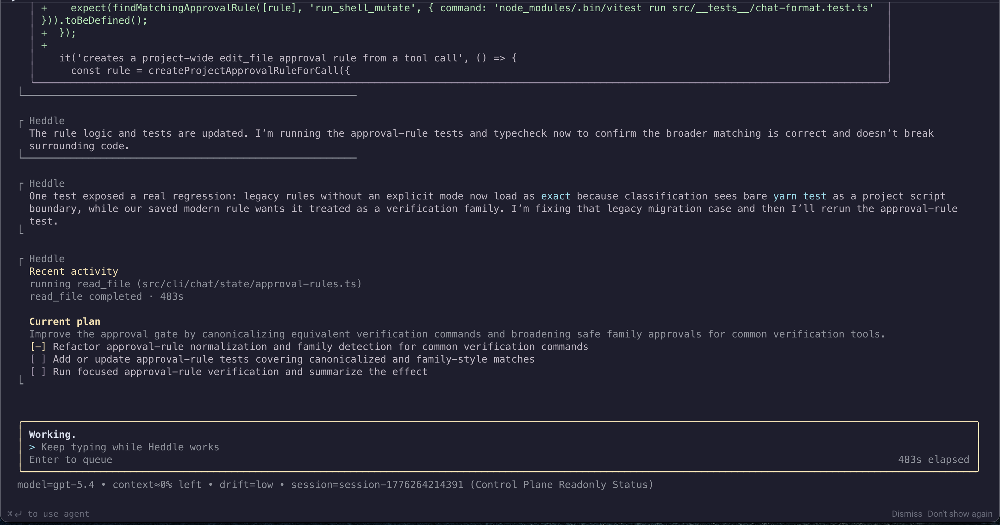
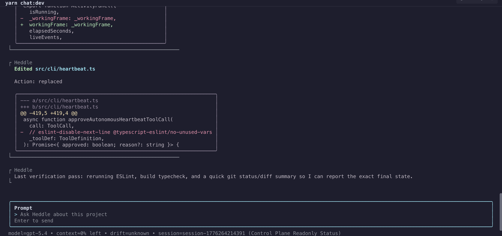
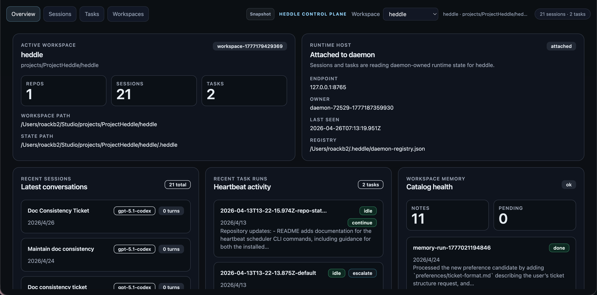
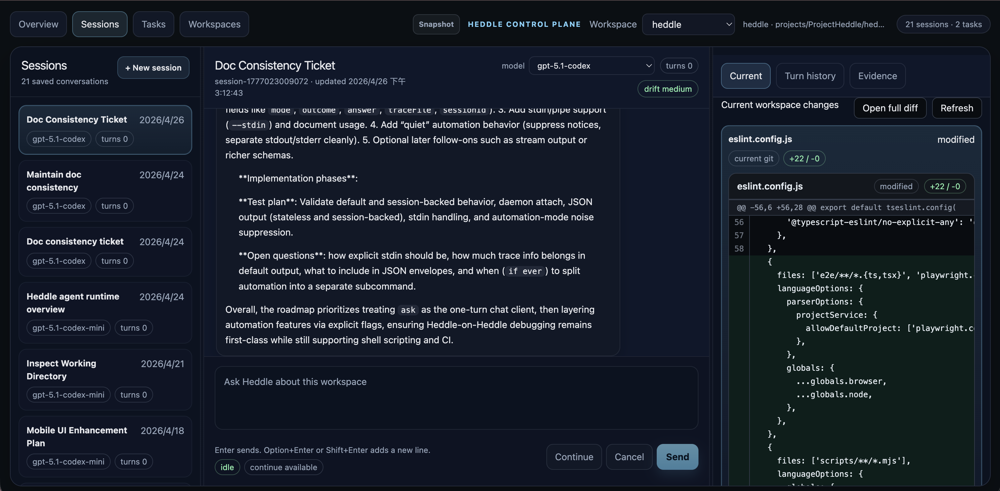
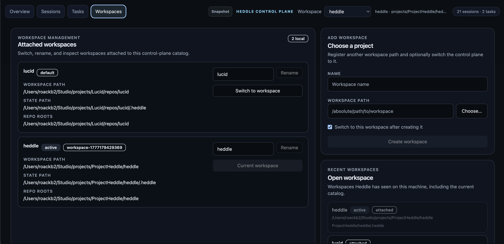
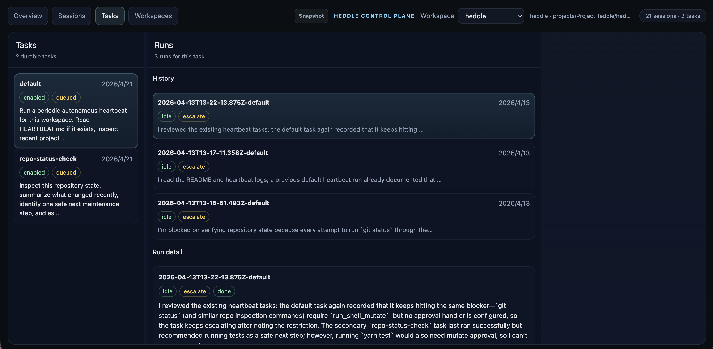
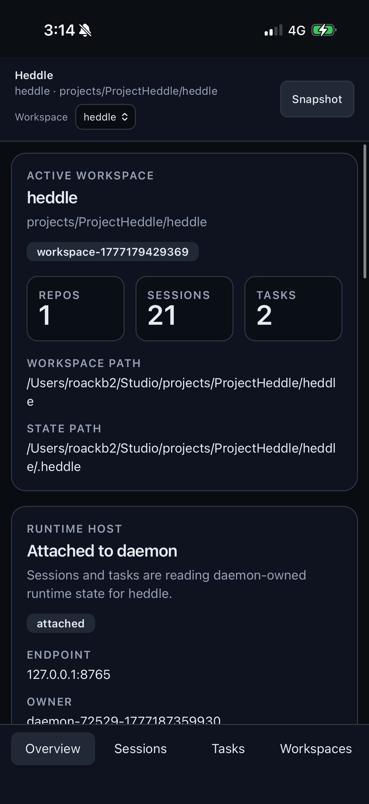
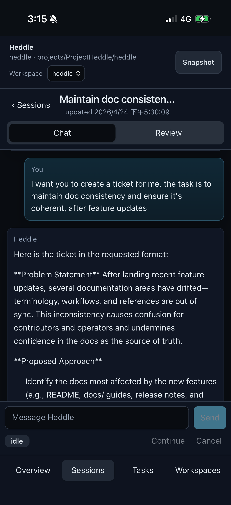
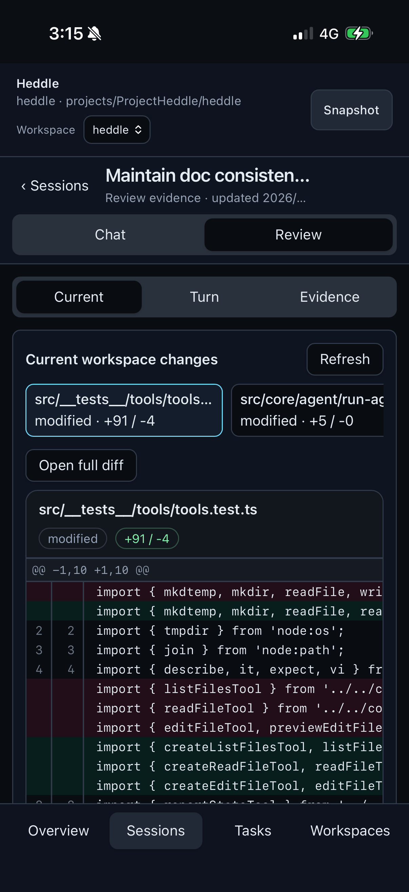
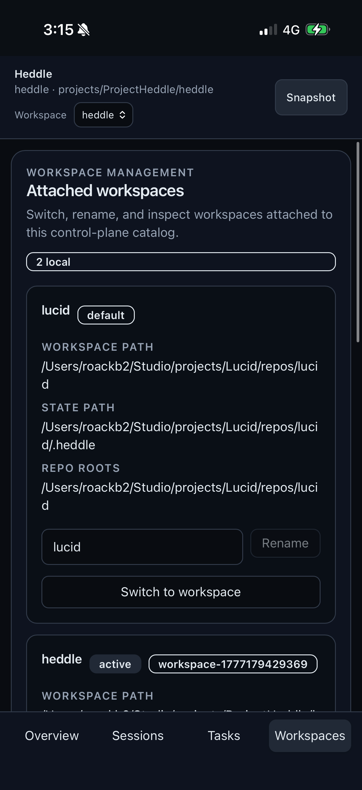

# Heddle

Heddle is an open-source AI coding agent runtime and terminal-first workspace for real project work.

It is designed for workflows where an agent needs to inspect a live repository, make bounded changes, verify results, keep continuity across sessions, and stay observable to the operator. Heddle supports OpenAI and Anthropic models, stores local workspace state under `.heddle/`, includes both a terminal chat experience and a browser control plane, learns durable workspace knowledge while it works, and gives users a review path for file diffs, commands, approvals, and traces.

In plain terms: Heddle is for people who want an AI coding assistant that can work inside actual projects, learn each project's operating knowledge over time, switch between local workspaces, and remain inspectable instead of acting like a black box.

## Why Try Heddle

Heddle is aimed at people who want more than a one-shot coding chat wrapper or stateless AI code assistant.

It is a good fit if you want:

- a terminal-first coding agent that works in a real repository
- an agent that learns durable project knowledge while working with you, using inspectable local memory
- explicit traces, approvals, and reviewable workflow artifacts
- a browser control plane for local oversight, workspace switching, and session review
- a path from interactive use to programmatic and scheduled agent workflows

Heddle is probably not the right fit if you only want a very simple one-shot prompt runner and do not care about sessions, persistence, observability, or operator control.

## What Heddle Does

At a high level, Heddle helps with:

- understanding unfamiliar repositories
- making code or doc changes inside a real workspace
- running bounded verification like builds, tests, and repo review
- keeping multi-step work going across sessions instead of starting from scratch each time
- switching between local workspaces from the browser control plane
- learning durable facts, preferences, and workflows from real usage
- exposing more operator visibility than a black-box chat tool

If you want a terminal-first coding agent with local state, review traces, workspace memory, and a path toward longer-running workflows, that is the problem Heddle is trying to solve.

## See Heddle

### Terminal coding workflow

Heddle working in the terminal with live progress, tool activity, plans, and review output:



Heddle can inspect files, explain code, make edits, run shell commands with the right approval model, and carry a task through multiple turns.

### Terminal change review

Terminal chat/dev workflow showing file edits, inline diff output, and verification-oriented follow-through:



### Browser control plane overview

The local control plane gives you a browser-based view of the current workspace, saved sessions, heartbeat tasks, workspace memory, and recent activity. It also shows which workspace is active, so browser sessions follow the selected project instead of the daemon launch directory:



### Browser session review

Saved session review in the control plane, with conversation history in the center and current change review on the right. Review starts from the current Git working tree, then separates historical turn diffs and command/approval evidence so you can focus on the change you need to inspect now:



### Workspace and task management

The Workspaces view lets you switch between local projects, register additional workspace roots, rename attached workspaces, and keep sessions tied to the workspace state under `.heddle/`:



Heartbeat tasks expose scheduled/background maintenance runs with durable run history and operator escalation state:



### Mobile control plane

The control plane also has a phone-oriented layout for checking sessions, reading the latest conversation, switching between workspace sections, and reviewing current diffs from another device:

<p>
  
  
  
  
</p>

## 2-Minute Try-It Path

1. Install Heddle:

```bash
npm install -g @roackb2/heddle
```

2. Configure provider access.

For OpenAI, you can either sign in with your own ChatGPT/Codex account:

```bash
heddle auth login openai
```

Or use a Platform API key:

```bash
export OPENAI_API_KEY=your_key_here
```

For Anthropic, use an API key:

```bash
export ANTHROPIC_API_KEY=your_key_here
```

OpenAI account sign-in is an experimental, user-selected transport for Heddle. It is not official OpenAI support, and Heddle is not affiliated with, endorsed by, or sponsored by OpenAI. Use of OpenAI services remains subject to OpenAI's terms and policies.

3. Move into any repository you want to inspect:

```bash
cd /path/to/project
```

4. Start chat:

```bash
heddle
```

5. Try a prompt like:

```text
Summarize this repository, show me the main build/test commands, and point out the likely entrypoints.
```

6. If you want the browser oversight UI too:

```bash
heddle daemon
```

Open the browser control plane from the daemon output. From there you can use `Overview`, `Sessions`, `Tasks`, and `Workspaces` to inspect the active workspace, continue saved sessions, review changes, and switch to another local project.

### Try The Learning Loop

Heddle gets more useful when it learns a reusable preference and applies it later. In chat, teach it a ticket format:

```text
Whenever I ask you to create a ticket, use these sections: problem statement, proposed approach, considered alternatives, conclusion.
```

Then start a fresh session and ask:

```text
Create a ticket for maintaining doc consistency after feature updates.
```

Heddle should recover the preference from its local memory catalog and produce the ticket in that structure. You can inspect what it learned with:

```bash
heddle memory status
heddle memory list
heddle memory search ticket
```

## Major Features

### Terminal chat for real coding work

The main way to use Heddle is interactive chat in a repository:

```bash
heddle
```

From there, Heddle can inspect files, explain code, make edits, run shell commands with the right approval model, and carry a task through multiple turns.

This is the core feature. If you only use Heddle as a coding agent in the terminal, this is the part you care about.

More: [Chat and sessions guide](docs/guides/chat-and-sessions.md)

### Sessions and continuity

Heddle keeps saved sessions under `.heddle/` so longer work does not have to reset every time. That means you can come back to an interrupted task, continue a previous debugging thread, or preserve project-specific context across runs.

This matters if you are doing real multi-step work rather than one-shot prompts.

Typical session commands include:

- `/session list`
- `/session switch <id>`
- `/continue`
- `/compact`

More: [Chat and sessions guide](docs/guides/chat-and-sessions.md)

### Knowledge Persistence: Heddle Learns While It Works

Heddle can learn durable project knowledge while it works with you.

When the agent notices reusable information — a preferred ticket format, a canonical verification command, an operational convention, a recurring repo quirk, or a stable workflow pattern — it can record a memory candidate and let a dedicated maintainer path fold that knowledge into cataloged markdown notes under `.heddle/memory/`.

The goal is practical recall: future sessions should know where to look instead of rediscovering the same context from scratch. Heddle does this through explicit catalogs, readable local notes, maintenance logs, and memory visibility commands rather than opaque retrieval.

The learning loop is intentionally concrete:

- notices durable facts and preferences during normal work
- records memory candidates without interrupting the user
- folds candidates into cataloged markdown through a maintainer path
- lets future sessions recover context through explicit discovery paths
- lets users audit memory with `heddle memory status/list/read/search/validate`

Try it on a real project: tell Heddle a durable preference or let it discover a stable workflow detail, then start a fresh session and watch it recover that context through the memory catalog.

For example, tell Heddle your preferred ticket template once, then ask for a ticket in a new session. The point is not just storing a note; it is making future work start from the operating knowledge you already taught the agent.

More: [Knowledge persistence](docs/guides/knowledge-persistence.md)

### Control plane and workspaces

The control plane is Heddle's local browser UI:

```bash
heddle daemon
```

It gives you a browser-based view into workspaces, sessions, run state, heartbeat tasks, memory health, and review-oriented details. The purpose is operator oversight: seeing what the agent is doing, reviewing history more comfortably, and managing local runs from a UI instead of only from the terminal.

If terminal chat is the execution surface, the control plane is the oversight surface.

The `Workspaces` section lets you register local projects, switch the control plane between them, rename workspace entries, and pick a project folder from the browser UI. Heddle also keeps a user-level workspace registry so projects you have opened from the CLI or daemon can be rediscovered later.

The `Sessions` section supports a coding-review flow built around current work first. Review starts from the live Git working tree for the active workspace, with changed files, structured read-only diffs, and a larger full-diff viewer when the side panel is too tight. Historical turn diffs, review commands, verification commands, approvals, and trace events are still available, but they are separated from current review so old evidence does not distract from the task at hand.

This is useful if you want a more inspectable and operator-friendly workflow than a plain CLI transcript. The layout adapts for phone use as well, with mobile-native navigation for Overview, Sessions, Tasks, and Workspaces, plus a focused Chat/Review session workflow.

More: [Control plane guide](docs/guides/control-plane.md)

### Runtime host model

Heddle is local-first, but it still has a runtime ownership model.

The short version is:

- the workspace is the project-level state and ownership unit
- one workspace should have one live runtime owner at a time
- that owner is either:
  - the embedded CLI command you started
  - or a background `heddle daemon`

This is why Heddle stores state under the workspace’s `.heddle/`, why the browser control plane acts as a client of the daemon rather than a separate runtime, and why the UI treats workspace switching as choosing which local `.heddle/` state to inspect and operate.

If you want to understand how `chat`, `ask`, the daemon, the control plane, and workspace-local state fit together, read:

- [Runtime host model](docs/guides/runtime-host-model.md)

### Heartbeat

Heartbeat is Heddle's model for bounded autonomous wake cycles.

Instead of only running when a human types a prompt, a heartbeat task lets Heddle wake up on a schedule, do a limited amount of work, checkpoint the result, and decide whether to continue, pause, complete, or escalate.

Example commands:

```bash
heddle heartbeat start --every 30m
heddle heartbeat task add --id repo-gardener --task "Check for safe maintenance work" --every 1h
heddle heartbeat task list
```

Why this exists: some agent work is not a single interactive chat. You may want periodic repo inspection, recurring maintenance checks, scheduled summaries, or a host that can resume work in bounded steps.

If you do not need scheduled or semi-autonomous workflows, you can ignore heartbeat entirely and just use chat.

More: [Heartbeat guide](docs/guides/heartbeat.md)

### Semantic drift

Semantic drift is optional telemetry that helps you see whether the assistant's responses appear to be moving away from the recent semantic trajectory of the conversation.

With optional [CyberLoop](https://www.npmjs.com/package/cyberloop) integration installed, Heddle can surface drift levels such as:

- `drift=unknown`
- `drift=low`
- `drift=medium`
- `drift=high`

This is an observability feature, not a magic correctness guarantee. It is meant to help operators notice when a run may be getting less aligned with its recent direction.

If you are just looking for a coding agent, you do not need to care about this on day one. If you care about agent observability and runtime behavior, it is one of Heddle's more distinctive features.

More: [Semantic drift](docs/guides/semantic-drift.md)

### Programmatic runtime APIs

Heddle is not only a CLI. The npm package also exposes runtime primitives such as `runAgentLoop` and `runAgentHeartbeat` so other hosts can build on top of it.

This is for people building their own agent hosts, schedulers, or control surfaces rather than only using the packaged CLI.

More: [Programmatic use](docs/guides/programmatic-use.md)

## Install

Global install:

```bash
npm install -g @roackb2/heddle
```

Run without a global install:

```bash
npx @roackb2/heddle
```

The installed CLI command is `heddle`.

## Requirements

- Node.js 20+
- access to at least one supported provider:
  - OpenAI account sign-in with `heddle auth login openai`, or `OPENAI_API_KEY`
  - `ANTHROPIC_API_KEY` for Anthropic models

Heddle intentionally does not support Anthropic consumer subscription OAuth. Use Anthropic API-key access unless Anthropic provides an approved third-party auth route.

## Optional CyberLoop Integration

If you want semantic drift telemetry in chat, install `cyberloop` in the same environment as Heddle:

```bash
npm install -g cyberloop
# or for project-local usage
npm install cyberloop
```

For one-off usage without a global install:

```bash
npx -p @roackb2/heddle -p cyberloop heddle
```

## Documentation

### Start here

- [Documentation hub](docs/README.md)
- [Runtime host model](docs/guides/runtime-host-model.md)
- [Chat and sessions guide](docs/guides/chat-and-sessions.md)
- [CLI reference](docs/reference/cli.md)

### Feature guides

- [Runtime host model](docs/guides/runtime-host-model.md)
- [Control plane](docs/guides/control-plane.md)
- [Heartbeat](docs/guides/heartbeat.md)
- [Knowledge persistence](docs/guides/knowledge-persistence.md)
- [Semantic drift](docs/guides/semantic-drift.md)
- [Programmatic use](docs/guides/programmatic-use.md)

### Contributors

- [Development and contributing](docs/guides/development.md)
- [Release convention](docs/releases/README.md)
- [Framework Vision](docs/framework-vision.md)
- [Coding Agent Roadmap](docs/coding-agent-roadmap.md)

## Project Status

Heddle is already useful for real coding-agent workflows, but it is still evolving.

Current strengths include:

- terminal-first coding and repository workflows
- autonomous, catalog-backed workspace memory that helps the agent learn from normal usage
- explicit traces, approvals, diff review, and local workspace state
- browser-based oversight and workspace switching through the control plane
- local-first heartbeat primitives for scheduled agent work
- practical programmatic hooks for custom hosts

Current limitations include:

- the browser control plane is read-only for file review; it is not yet an editable IDE-like diff environment
- some advanced workflows remain better documented in source and examples than in polished product UX
- the project surface is still changing as the runtime matures

## Development

If you want to work on Heddle itself:

```bash
git clone https://github.com/roackb2/heddle.git
cd heddle
yarn install
yarn build
yarn test
```

See [Development and contributing](docs/guides/development.md) for the fuller contributor workflow.

## License

MIT
