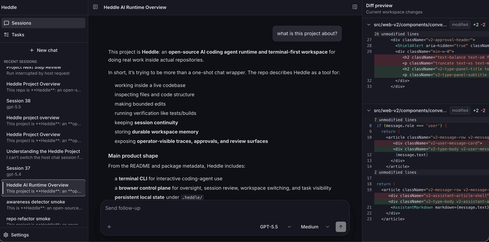
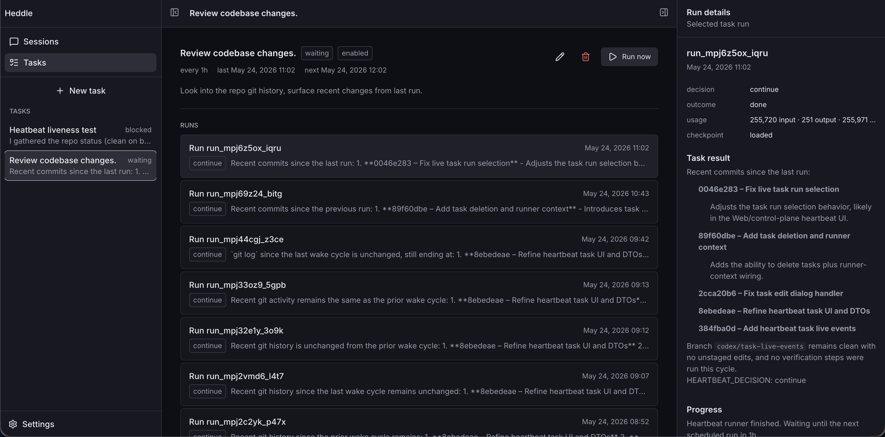
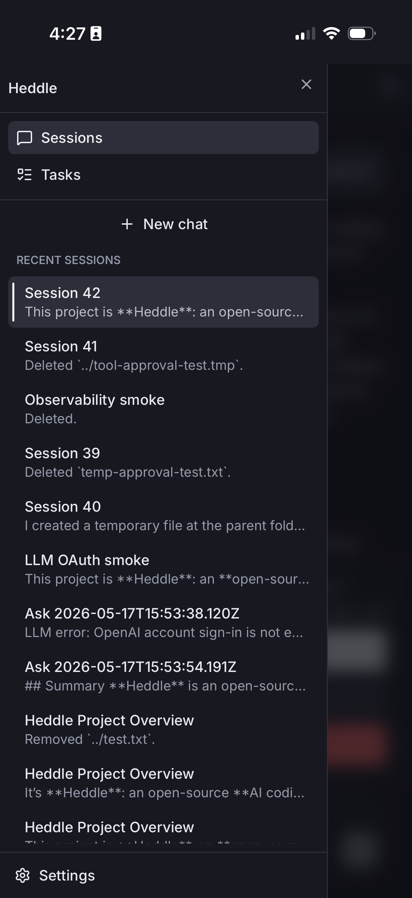
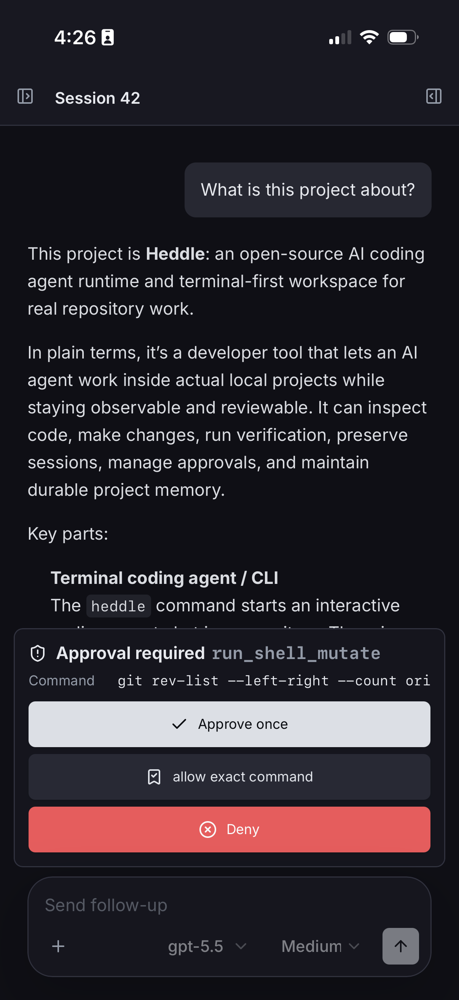
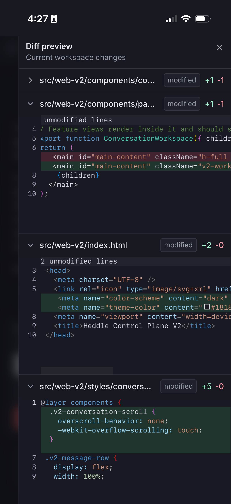

# Heddle

[English](README.md) | [繁體中文](README.zh-TW.md)

Heddle is an open-source AI coding agent runtime and terminal-first workspace for shipping features, fixing bugs, and operating software with reviewable agent help.

Official website: [heddleagent.com](https://heddleagent.com)

> **Terminal UI v2 is now the default.** Run `heddle` or `heddle chat` to use the API-backed terminal experience. Messages, run events, and agent response streams flow through the shared control-plane path, so terminal, browser, and mobile clients can follow the same work at the same time.

## Agenda

- [What Heddle Can Do](#what-heddle-can-do)
- [See It In Action](#see-it-in-action)
- [Quick Start](#quick-start)
- [Core Workflows](#core-workflows)
  - [Terminal Coding](#terminal-coding)
  - [Model Providers](#model-providers)
  - [Browser Control Plane](#browser-control-plane)
  - [Sessions And Continuity](#sessions-and-continuity)
  - [Project Instructions](#project-instructions)
  - [Knowledge Persistence](#knowledge-persistence)
  - [Agent Skills](#agent-skills)
  - [Custom Agents](#custom-agents)
  - [Browser Automation](#browser-automation)
  - [MCP Integrations](#mcp-integrations)
  - [Heartbeat](#heartbeat)
  - [Programmatic Runtime](#programmatic-runtime)
  - [Semantic Drift](#semantic-drift)
- [Install](#install)
- [Requirements](#requirements)
- [Optional CyberLoop Integration](#optional-cyberloop-integration)
- [Documentation](#documentation)
- [Project Status](#project-status)
- [Development](#development)
- [License](#license)

## What Heddle Can Do

Heddle is for engineers, maintainers, and side-project builders who want an AI coding assistant that can help with day-to-day software work while keeping local continuity and reviewable execution.

It is a good fit when you want to:

- inspect and understand unfamiliar repositories
- develop new product features for work or side projects
- build frontend pages, backend services, CLIs, docs, and tests
- fix bugs, investigate regressions, and explain unfamiliar code paths
- refactor existing modules while preserving reviewable diffs
- run bounded verification such as builds, tests, and repo review
- keep multi-step implementation work going across saved sessions
- review file diffs, commands, approvals, traces, and semantic activity before accepting changes
- switch between local workspaces from a browser control plane
- let the agent learn durable project knowledge over time
- activate standard Agent Skills only when a workspace should expose them
- define custom agents for turn-scoped roles such as ask, code, review, docs writing, or release operations
- connect configured MCP servers such as Notion, Anytype, GitHub, or other tools
- opt into Browser Automation for rendered page inspection and user-requested web workflows
- run against hosted models, local Ollama, and OpenAI-compatible providers through Heddle's provider adapters
- build custom hosts on top of Heddle's runtime APIs

Heddle is probably not the right fit if you only want a very simple one-shot prompt runner and do not care about sessions, persistence, observability, or operator control.

## See It In Action

Terminal, browser, and mobile surfaces can observe the same live session at once:


Review and approve sensitive actions from the control plane while the agent run stays visible:


Inspect workspace diffs from browser and mobile while the same conversation continues:


Heddle also works as a terminal-first coding agent with live progress, tool activity, plans, and review output:


Terminal chat/dev workflow showing file edits, inline diff output, and verification-oriented follow-through:


The default local control plane is the web-v2 browser client served by `heddle daemon`:



The task workbench covers recurring heartbeat tasks, live run state, and run result review:



The same control plane supports mobile layouts, with the session list, workbench, and diff preview exposed as focused panels:

<p>
  
  
  
</p>

## Quick Start

1. Install Heddle:

```bash
npm install -g @roackb2/heddle
```

2. Configure provider access.

For OpenAI, you can either sign in with your own ChatGPT/Codex account:

```bash
heddle auth login openai
```

Or use a Platform API key:

```bash
export OPENAI_API_KEY=your_key_here
```

If you keep both a stored OpenAI OAuth credential and an API key around for testing, you can explicitly prefer the API key for a run:

```bash
heddle --prefer-api-key
heddle --prefer-api-key ask "Summarize this repository"
heddle --prefer-api-key daemon
```

For Anthropic, use an API key:

```bash
export ANTHROPIC_API_KEY=your_key_here
```

For local models, install and start [Ollama](https://ollama.com), then select one of your installed chat models with the `ollama/` prefix:

```bash
ollama list
heddle --model ollama/llama3.2:latest ask "Reply with exactly: ok"
```

Ollama does not require a hosted provider API key. Heddle uses Ollama's local OpenAI-compatible endpoint at `http://127.0.0.1:11434/v1` by default. Heddle also supports OpenAI-compatible providers such as LM Studio, LiteLLM, vLLM, Hugging Face, OpenRouter, Together AI, and Groq; see [Model Providers](#model-providers).

OpenAI account sign-in is an experimental, user-selected transport for Heddle. It is not official OpenAI support, and Heddle is not affiliated with, endorsed by, or sponsored by OpenAI. Use of OpenAI services remains subject to OpenAI's terms and policies.

3. Move into any repository you want to inspect:

```bash
cd /path/to/project
```

4. Start chat:

```bash
heddle
```

5. Try a prompt like:

```text
Summarize this repository, show me the main build/test commands, and point out the likely entrypoints.
```

6. If you want the browser oversight UI too:

```bash
heddle daemon
```

Open the browser control plane from the daemon output. From there you can use `Sessions`, `Tasks`, and `Settings` to inspect the active workspace, continue saved sessions, review changes, inspect memory status, and switch to another local project.

For a one-shot run instead of interactive chat:

```bash
heddle ask "Summarize this repository"
```

`ask` exits after one prompt, but it records the run as a one-off saved session under `.heddle/` so traces, memory maintenance, and later inspection use the same persisted conversation path as normal sessions.

### Try The Learning Loop

Heddle gets more useful when it learns a reusable preference and applies it later. In chat, teach it a ticket format:

```text
Whenever I ask you to create a ticket, use these sections: problem statement, proposed approach, considered alternatives, conclusion.
```

Then start a fresh session and ask:

```text
Create a ticket for maintaining doc consistency after feature updates.
```

Heddle should recover the preference from its local memory catalog and produce the ticket in that structure. You can inspect what it learned with:

```bash
heddle memory status
heddle memory list
heddle memory search ticket
```

## Core Workflows

### Terminal Coding

The main way to use Heddle is interactive chat in a repository:

```bash
heddle
```

From there, Heddle can inspect files, search with ignore-aware fallbacks, explain code, make edits, run shell commands with the right approval model, and carry a task through multiple turns.

The terminal composer supports multiline prompts, prompt undo/redo, prompt history navigation, model picking with `/model set`, and reasoning-effort picking with `/reasoning set`. During a run, Heddle streams visible activity so you can see whether it is thinking, searching, calling tools, updating a plan, or waiting for approval.

More: [Chat and sessions guide](docs/guides/chat-and-sessions.md)

### Model Providers

Heddle is not tied to one model vendor. It supports hosted frontier models, local models, and OpenAI-compatible gateways through provider adapters. This lets you choose the right tradeoff for each run: strongest hosted model, private local model, self-hosted inference server, or a routing gateway.

Supported provider families:

- OpenAI, including OpenAI account sign-in and Platform API-key mode
- Anthropic Claude via API key
- Ollama local models with the `ollama/` prefix
- LM Studio local server models with the `lmstudio/` prefix
- LiteLLM gateway models with the `litellm/` prefix
- vLLM self-hosted OpenAI-compatible models with the `vllm/` prefix
- Hugging Face router models with the `huggingface/` or `hf/` prefix
- OpenRouter models with the `openrouter/` prefix
- Together AI models with the `together/` prefix
- Groq models with the `groq/` prefix

Start Ollama, pull or install a chat-capable model, then choose it with the `ollama/` model prefix:

```bash
ollama list
heddle --model ollama/llama3.2:latest ask "Summarize this repository"
heddle chat --model ollama/llama3.2:latest
```

For other OpenAI-compatible providers, select models with their profile prefix:

```bash
heddle --model lmstudio/local-model ask "Reply with exactly: ok"
heddle --model openrouter/meta-llama/llama-3.3-70b-instruct ask "Summarize this repository"
```

Inside terminal chat, use `/model set <query>` to search available models. The terminal picker and browser model selector use the same model-options service: Ollama is discovered from the local Ollama API, and other OpenAI-compatible profiles are discovered from `/models` when their local server is running or their hosted API key is configured.

```text
/model set llama
/model ollama/llama3.2:latest
```

Local and gateway model quality varies. Some smaller, older, or provider-routed models are not reliable at tool calling, may ignore tool results, or may produce confident but wrong repository answers. Use manual review, keep approval prompts enabled for risky work, and prefer stronger models for edits that matter.

More: [Model providers](docs/reference/model-providers.md) and [Providers and models](docs/reference/providers-and-models.md)

### Browser Control Plane

The control plane is Heddle's local browser UI:

```bash
heddle daemon
```

It gives you a browser-based view into workspaces, saved conversations, live assistant streaming, tool progress, approvals, current workspace diffs, heartbeat tasks, memory health, and settings.

While the control plane is open, Heddle can notify you when any session in the open workspace needs approval or finishes, and when heartbeat task runs finish for the open workspace. Enable browser notifications from `Settings > General`; Heddle also keeps an in-app toast and marks the browser tab title so the event remains visible even when the operating system suppresses the browser banner.

The workspace switcher and `Settings > Workspace` page let you register local projects, switch the control plane between them, rename workspace entries, and pick a project folder from the browser UI. The `Sessions` section is built around current work first: review starts from the live Git working tree, with changed files, structured read-only diffs, and a larger full-diff viewer when the side panel is too tight.

Session rows in the browser control plane support right-click actions for common session management: pin or unpin important conversations, rename a session inline, or archive a session so it is hidden from normal session lists. Archiving is reversible immediately from the toast undo action.

If terminal chat is the execution surface, the control plane is the oversight surface.

More: [Control plane guide](docs/guides/control-plane.md)

### Sessions And Continuity

Heddle keeps saved sessions under `.heddle/` so longer work does not have to reset every time. Current versions store the session catalog at `.heddle/chat-sessions.catalog.json` and per-session bodies under `.heddle/chat-sessions/`.

Typical session commands include:

```text
/session list
/session choose <query>
/session new [name]
/session switch <id>
/session continue <id>
/session rename <name>
/session pin
/session unpin
/continue
/compact
/model set
/reasoning set
```

The browser control plane adds right-click session actions for pinning, inline rename, and archiving. Archived sessions are hidden from the normal session list; the archive toast includes an undo action right after archiving.

More: [Chat and sessions guide](docs/guides/chat-and-sessions.md)

### Project Instructions

Heddle can load a short project instruction file at startup so a fresh session starts with the repository's operating context. By default it loads the first non-empty file found in this order: `HEDDLE.md`, `AGENTS.md`, `CLAUDE.md`.

Only one default file is loaded to preserve context space. If a project needs a different path or intentionally wants multiple files, set `agentContextPaths` in `.heddle/config.json`.

More: [Project config](docs/reference/config.md)

### Knowledge Persistence

Heddle can learn durable project knowledge while it works with you.

When the agent notices reusable information such as a preferred ticket format, a canonical verification command, an operational convention, a recurring repo quirk, or a stable workflow pattern, it can record a memory candidate and let a dedicated maintainer path fold that knowledge into cataloged markdown notes under `.heddle/memory/`.

The goal is practical recall: future sessions should know where to look instead of rediscovering the same context from scratch. Heddle does this through explicit catalogs, readable local notes, maintenance logs, and memory visibility commands rather than opaque retrieval.

More: [Knowledge persistence](docs/guides/knowledge-persistence.md)

### Agent Skills

Heddle supports the standard Agent Skills folder format for reusable, opt-in agent workflows. Put project skills under `.agents/skills/<name>/SKILL.md` or user skills under `~/.agents/skills/<name>/SKILL.md`, then manage workspace activation from chat:

```text
/skills
/skills enable <name>
/skills disable <name>
```

Heddle also ships built-in skills for Heddle-owned capabilities. Capability settings can activate those built-ins without asking users to install separate skill files.

Only active skills are shown to the agent. Heddle initially exposes a compact catalog with each active skill's name and description, then the agent can call `read_agent_skill` to fetch the full `SKILL.md` body when a skill is relevant. Activation state is stored under `.heddle/skills/activation.json`; skill definitions stay in their original folders.

Skills are instructions, not permissions. They do not bypass Heddle's approval policy or tool safety checks, so users remain responsible for which project or user skills they enable.

More: [Agent Skills guide](docs/guides/agent-skills.md)

### Custom Agents

Custom agents let you choose the role Heddle should use for a specific turn.
Heddle ships built-in Ask, Code, and Review modes as custom agents, and you can
define your own project or user agents for specialized work such as repository
review, docs writing, release operation, or incident investigation.

A custom agent is a named runtime profile:

- prompt appendix: extra instructions appended to Heddle's default system prompt
- tool profile: which tools the model can see for that turn
- approval profile: whether the agent is read-only, asks interactively, or uses auto-approved trusted actions
- runtime defaults: optional defaults such as `maxSteps`, model, or reasoning effort

Agent selection is turn-scoped, not session-scoped. In the same saved session,
you can ask a question with Ask, switch to Code for implementation, then switch
to Review for feedback.

Project agents live under `.agents/agents/<id>/AGENT.md`; user agents live under
`~/.agents/agents/<id>/AGENT.md`. The file starts with YAML frontmatter and the
markdown body becomes the prompt appendix:

```md
---
schemaVersion: 1
id: repo-reviewer
name: Repo Reviewer
description: Review repository changes without applying fixes.
modeAlias: review
runtime:
  maxSteps: 80
tools:
  preset: inspect
approval:
  preset: read_only
---

You are a repository review agent. Prioritize correctness, reliability, missing
tests, and maintainability. Do not edit files or run mutation commands.
```

Use Settings -> Agents in the browser control plane to create or inspect project
agents. In chat, use the composer plus menu to choose Ask, Code, Review, or a
custom agent for the next prompt. For one-shot terminal usage:

```bash
heddle ask --agent repo-reviewer "Review the current workspace changes"
heddle ask --mode review "Review the current diff"
```

Custom agents are role profiles; Agent Skills are reusable instructions the
agent may load when relevant. A custom agent can still use active skills when
its tool profile includes `read_agent_skill`.

More: [Custom Agents guide](docs/guides/custom-agents.md)

### Browser Automation

Browser Automation is an opt-in capability for tasks where the agent should see or operate real web pages instead of relying only on code inspection, tests, or plain web search.

Use it when you want Heddle to:

- visually inspect a frontend after local UI changes
- capture page snapshots or screenshots as evidence
- interact with a website the user asked it to browse
- compare visible product/listing pages
- use rendered DOM state that is not available from static files or APIs

Browser Automation is off by default. Enable it from Settings -> Browser Automation or chat:

```text
/browser
/browser enable
/browser disable
/browser headed
/browser headless
/browser profile <id>
/browser backend <playwright|native-chrome>
/browser endpoint <url>
/browser launch-native [url]
/browser check-native
/browser channel <chromium|chrome|msedge>
/browser open-profile [url]
/browser close-profile
```

Enabling Browser Automation activates Heddle's package-owned `browser-automation` Agent Skill and adds these tools to future default agent turns:

```text
browser_open
browser_snapshot
browser_click
browser_screenshot
browser_close
```

The built-in skill teaches the agent when browser automation is appropriate and when `web_search` is only useful for discovering a starting URL. Browser policy still remains authoritative: unsafe actions, off-domain navigation, and ambiguous JavaScript-only clicks can be blocked or require approval.

Current behavior:

- if no explicit domain allowlist is configured, the first `browser_open` URL establishes the same-domain browsing boundary for that browser session
- snapshots return scoped refs for safe `browser_click` calls
- screenshots and browser evidence are stored under Heddle state
- Settings -> Browser Automation and `/browser profile <id>` select a Heddle-owned profile under `.heddle/browser-profiles/`
- Settings -> Browser Automation and `/browser channel <chromium|chrome|msedge>` select the Playwright browser channel for future agent runs and manual profile windows
- `/browser headed` opens future runs in a visible Playwright window so you can prepare a logged-in session; `/browser headless` reuses that profile without showing the window
- Settings -> Browser Automation and `/browser open-profile [url]` can open the selected profile in a visible manual window for login/session management; close it with `/browser close-profile` before asking an agent to use the same profile
- Settings -> Browser Automation and `/browser launch-native [url]` can launch locally installed Chrome with a Heddle-owned profile and CDP endpoint; keep that Chrome window open, then verify it with `/browser check-native`
- logged-in sites require the selected browser profile to already have a valid session

Browser Automation agenda:

- add form-safe browser tools such as `browser_type`, `browser_fill`, and `browser_press`
- surface browser evidence and screenshots in the control plane
- design a live browser preview path, likely screenshot/CDP screencast based rather than embedding Playwright's native headed window
- add richer policy and approval flows for harmless same-origin UI clicks

### MCP Integrations

Heddle can connect to user-configured Model Context Protocol servers so the agent can use ecosystem tools such as Notion, Anytype, GitHub, or other MCP integrations through Heddle's approval and trace path.

Configure servers by pasting a standard `mcpServers` JSON document into Settings -> MCP, editing `.heddle/mcp.json` directly, or opening that file from chat with `/mcp config`. Server config is separate from workspace activation: after saving config, explicitly enable and refresh the server before future agent turns can see its cached tools.

```text
/mcp
/mcp config
/mcp enable <server>
/mcp refresh <server>
/mcp disable <server>
```

Refreshing an enabled server caches its tool catalog under `.heddle/mcp/`. Future agent turns can inspect MCP tools with `mcp_list_tools` and call them through approval-gated MCP tool adapters.

More: [MCP integrations](docs/reference/mcp.md)

### Heartbeat

Heartbeat is Heddle's model for bounded autonomous wake cycles.

Instead of only running when a human types a prompt, a heartbeat task lets Heddle wake up on a schedule, do a limited amount of work, checkpoint the result, and decide whether to continue, pause, complete, or escalate.

Example commands:

```bash
heddle heartbeat start --every 30m
heddle heartbeat task add --id repo-gardener --task "Check for safe maintenance work" --every 1h
heddle heartbeat task list
```

Why this exists: some agent work is not a single interactive chat. You may want periodic repo inspection, recurring maintenance checks, scheduled summaries, or a host that can resume work in bounded steps.

More: [Heartbeat guide](docs/guides/heartbeat.md)

### Programmatic Runtime

Heddle is not only a CLI. The npm package exposes two main programmatic layers:

- `createConversationEngine`: an alpha API for persisted multi-turn sessions with session storage, compaction, approvals, traces, semantic activity, and custom frontends or local hosts
- `AgentLoopRuntimeService.run(...)`: a lower-level single-run execution loop for hosts that do not need persisted chat or session behavior

Advanced hosts can also reuse lower-level class APIs such as `ToolRegistry`, `ToolExecutionService`, `TraceRecorder`, `TraceConsoleFormatter`, and `ReviewDiffParser` when they intentionally assemble custom runtime or review surfaces.

Other exported primitives include `HeartbeatRunnerAgent.run`, `HeartbeatSchedulerService.runDueTasks`, and `FileHeartbeatTaskService` for scheduled or custom host workflows.

More: [Programmatic use](docs/guides/programmatic-use.md)

### Semantic Drift

Semantic drift is optional telemetry that helps you see whether the assistant's responses appear to be moving away from the recent semantic trajectory of the conversation.

With optional [CyberLoop](https://www.npmjs.com/package/cyberloop) integration installed, Heddle can surface drift levels such as:

- `drift=unknown`
- `drift=low`
- `drift=medium`
- `drift=high`

This is an observability feature, not a correctness guarantee. It is meant to help operators notice when a run may be getting less aligned with its recent direction.

More: [Semantic drift](docs/guides/semantic-drift.md)

## Install

Global install:

```bash
npm install -g @roackb2/heddle
```

Run without a global install:

```bash
npx @roackb2/heddle
```

The installed CLI command is `heddle`.

## Requirements

- Node.js 20+
- access to at least one supported provider:
  - OpenAI account sign-in with `heddle auth login openai`, or `OPENAI_API_KEY`
  - `ANTHROPIC_API_KEY` for Anthropic models
  - a local Ollama, LM Studio, LiteLLM, or vLLM server for local OpenAI-compatible models
  - a hosted gateway API key such as `HF_TOKEN`, `OPENROUTER_API_KEY`, `TOGETHER_API_KEY`, or `GROQ_API_KEY`

Heddle intentionally does not support Anthropic consumer subscription OAuth. Use Anthropic API-key access unless Anthropic provides an approved third-party auth route.

## Optional CyberLoop Integration

If you want semantic drift telemetry in chat, install `cyberloop` in the same environment as Heddle:

```bash
npm install -g cyberloop
# or for project-local usage
npm install cyberloop
```

For one-off usage without a global install:

```bash
npx -p @roackb2/heddle -p cyberloop heddle
```

## Documentation

Start here:

- [Documentation hub](docs/README.md)
- [Runtime host model](docs/guides/runtime-host-model.md)
- [Chat and sessions guide](docs/guides/chat-and-sessions.md)
- [Providers and models](docs/reference/providers-and-models.md)
- [CLI reference](docs/reference/cli.md)

Feature guides:

- [Control plane](docs/guides/control-plane.md)
- [Heartbeat](docs/guides/heartbeat.md)
- [Agent Skills](docs/guides/agent-skills.md)
- [Custom Agents](docs/guides/custom-agents.md)
- Browser Automation: see the Browser Automation section above
- [MCP integrations](docs/reference/mcp.md)
- [Knowledge persistence](docs/guides/knowledge-persistence.md)
- [Semantic drift](docs/guides/semantic-drift.md)
- [Programmatic use](docs/guides/programmatic-use.md)

Contributors:

- [Agent context](docs/agent-context.md)
- [Project posture](docs/project-posture.md)
- [Development and contributing](docs/guides/development.md)
- [Release convention](docs/releases/README.md)
- [Framework Vision](docs/strategy/framework-vision.md)
- [Coding Agent Roadmap](docs/strategy/coding-agent-roadmap.md)

## Project Status

Heddle is already useful for real coding-agent workflows, but it is still evolving.

Current strengths include:

- terminal-first coding and repository workflows
- autonomous, catalog-backed workspace memory that helps the agent learn from normal usage
- standard Agent Skills support with workspace-level activation and progressive disclosure
- custom agents for turn-scoped role, tool, approval, and runtime profiles
- opt-in Browser Automation with browser snapshots, screenshots, policy checks, and a published next-step agenda
- MCP integration support for user-configured ecosystem tools
- explicit traces, approval previews, diff review, and local workspace state
- browser-based oversight and workspace switching through the control plane
- local-first heartbeat primitives for scheduled agent work
- practical programmatic hooks for custom hosts

Current limitations include:

- the browser control plane is read-only for file review; it is not yet an editable IDE-like diff environment
- Browser Automation still needs profile management, form-safe actions, and richer browser evidence surfaces
- some advanced workflows remain better documented in source and examples than in polished product UX
- the project surface is still changing as the runtime matures

## Development

If you want to work on Heddle itself:

```bash
git clone https://github.com/roackb2/heddle.git
cd heddle
yarn install
yarn build
yarn test
```

`yarn test` runs the default unit and integration suites. Browser integration coverage lives under `src/__tests__/browser-integration` and runs on PRs; run it locally with `yarn test:browser-integration`.

See [Development and contributing](docs/guides/development.md) for the fuller contributor workflow.

## License

Heddle is licensed under the MIT License. See [LICENSE](LICENSE).
