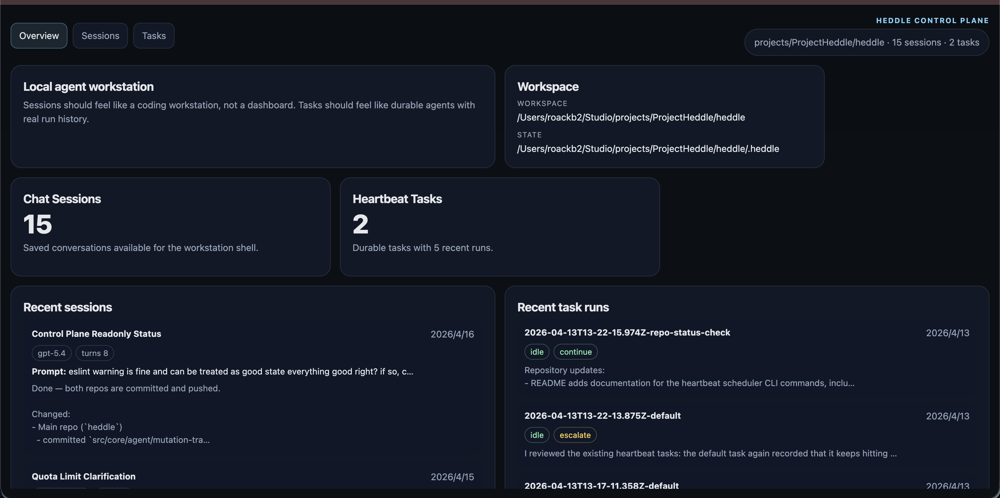
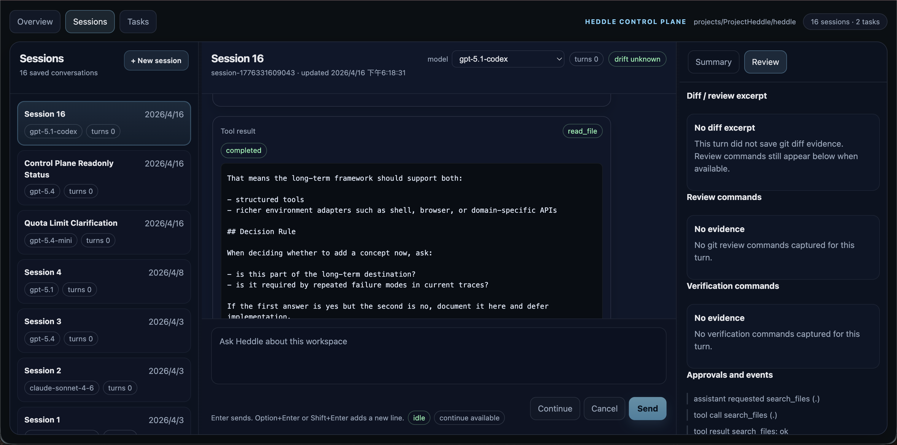

# Heddle

Heddle is an open-source terminal coding agent runtime and CLI for real project work.

It is designed for workflows where an agent needs to inspect a live repository, make bounded changes, verify results, keep continuity across sessions, and stay observable to the operator. Heddle supports OpenAI and Anthropic models, stores local workspace state under `.heddle/`, and includes both a terminal chat experience and a browser control plane.

In plain terms: Heddle is for people who want an agent that can work inside an actual project, not just answer isolated prompts.

## Why Try Heddle

Heddle is aimed at people who want more than a one-shot coding chat wrapper.

It is a good fit if you want:

- a terminal-first coding agent that works in a real repository
- local state and durable project memory
- explicit traces, approvals, and reviewable workflow artifacts
- a browser control plane for local oversight
- a path from interactive use to programmatic and scheduled agent workflows

Heddle is probably not the right fit if you only want a very simple one-shot prompt runner and do not care about sessions, persistence, observability, or operator control.

## What Heddle Does

At a high level, Heddle helps with:

- understanding unfamiliar repositories
- making code or doc changes inside a real workspace
- running bounded verification like builds, tests, and repo review
- keeping multi-step work going across sessions instead of starting from scratch each time
- exposing more operator visibility than a black-box chat tool

If you want a terminal-first coding agent with local state, review traces, and a path toward longer-running workflows, that is the problem Heddle is trying to solve.

## See Heddle

### Terminal coding workflow

Heddle working in the terminal with live progress, tool activity, plans, and review output:


Heddle can inspect files, explain code, make edits, run shell commands with the right approval model, and carry a task through multiple turns.

### Terminal change review

Terminal chat/dev workflow showing file edits, inline diff output, and verification-oriented follow-through:


### Browser control plane overview

The local control plane gives you a browser-based view of the current workspace, saved sessions, heartbeat tasks, and recent activity:



### Browser session review

Saved session review in the control plane, with conversation history in the center and review evidence on the right:



### Mobile control plane

The control plane also has a phone-oriented layout for checking sessions, reading the latest conversation, and reviewing evidence from another device:

<p>
  
  
  
</p>

## 2-Minute Try-It Path

1. Install Heddle:

```bash
npm install -g @roackb2/heddle
```

2. Set a provider API key:

```bash
export OPENAI_API_KEY=your_key_here
# or
export ANTHROPIC_API_KEY=your_key_here
```

3. Move into any repository you want to inspect:

```bash
cd /path/to/project
```

4. Start chat:

```bash
heddle
```

5. Try a prompt like:

```text
Summarize this repository, show me the main build/test commands, and point out the likely entrypoints.
```

6. If you want the browser oversight UI too:

```bash
heddle daemon
```

## Major Features

### Terminal chat for real coding work

The main way to use Heddle is interactive chat in a repository:

```bash
heddle
```

From there, Heddle can inspect files, explain code, make edits, run shell commands with the right approval model, and carry a task through multiple turns.

This is the core feature. If you only use Heddle as a coding agent in the terminal, this is the part you care about.

More: [Chat and sessions guide](docs/guides/chat-and-sessions.md)

### Sessions and continuity

Heddle keeps saved sessions under `.heddle/` so longer work does not have to reset every time. That means you can come back to an interrupted task, continue a previous debugging thread, or preserve project-specific context across runs.

This matters if you are doing real multi-step work rather than one-shot prompts.

Typical session commands include:

- `/session list`
- `/session switch <id>`
- `/continue`
- `/compact`

More: [Chat and sessions guide](docs/guides/chat-and-sessions.md)

### Control plane

The control plane is Heddle's local browser UI:

```bash
heddle daemon
```

It gives you a browser-based view into sessions, run state, heartbeat tasks, and review-oriented details. The purpose is operator oversight: seeing what the agent is doing, reviewing history more comfortably, and managing local runs from a UI instead of only from the terminal.

If terminal chat is the execution surface, the control plane is the oversight surface.

This is useful if you want a more inspectable and operator-friendly workflow than a plain CLI transcript. The layout adapts for phone use as well, with mobile-native session navigation, bottom root navigation, a compact chat composer, and dedicated session info/review views.

More: [Control plane guide](docs/guides/control-plane.md)

### Knowledge persistence

Heddle can keep durable project knowledge in markdown notes under `.heddle/memory/`.

The idea is simple: if the agent learns a stable fact about your repo — architecture notes, command quirks, recurring build issues, conventions — it can save that knowledge so future sessions do not have to rediscover it.

This is not meant to be a hidden vector database or magical long-term memory. It is readable, local, workspace-scoped memory that both the agent and the human can inspect.

This matters if you want the agent to become more useful over time in a specific project.

More: [Knowledge persistence](docs/guides/knowledge-persistence.md)

### Heartbeat

Heartbeat is Heddle's model for bounded autonomous wake cycles.

Instead of only running when a human types a prompt, a heartbeat task lets Heddle wake up on a schedule, do a limited amount of work, checkpoint the result, and decide whether to continue, pause, complete, or escalate.

Example commands:

```bash
heddle heartbeat start --every 30m
heddle heartbeat task add --id repo-gardener --task "Check for safe maintenance work" --every 1h
heddle heartbeat task list
```

Why this exists: some agent work is not a single interactive chat. You may want periodic repo inspection, recurring maintenance checks, scheduled summaries, or a host that can resume work in bounded steps.

If you do not need scheduled or semi-autonomous workflows, you can ignore heartbeat entirely and just use chat.

More: [Heartbeat guide](docs/guides/heartbeat.md)

### Semantic drift

Semantic drift is optional telemetry that helps you see whether the assistant's responses appear to be moving away from the recent semantic trajectory of the conversation.

With optional [CyberLoop](https://www.npmjs.com/package/cyberloop) integration installed, Heddle can surface drift levels such as:

- `drift=unknown`
- `drift=low`
- `drift=medium`
- `drift=high`

This is an observability feature, not a magic correctness guarantee. It is meant to help operators notice when a run may be getting less aligned with its recent direction.

If you are just looking for a coding agent, you do not need to care about this on day one. If you care about agent observability and runtime behavior, it is one of Heddle's more distinctive features.

More: [Semantic drift](docs/guides/semantic-drift.md)

### Programmatic runtime APIs

Heddle is not only a CLI. The npm package also exposes runtime primitives such as `runAgentLoop` and `runAgentHeartbeat` so other hosts can build on top of it.

This is for people building their own agent hosts, schedulers, or control surfaces rather than only using the packaged CLI.

More: [Programmatic use](docs/guides/programmatic-use.md)

## Install

Global install:

```bash
npm install -g @roackb2/heddle
```

Run without a global install:

```bash
npx @roackb2/heddle
```

The installed CLI command is `heddle`.

## Requirements

- Node.js 20+
- an API key for at least one supported provider:
  - `OPENAI_API_KEY`
  - `ANTHROPIC_API_KEY`

## Optional CyberLoop Integration

If you want semantic drift telemetry in chat, install `cyberloop` in the same environment as Heddle:

```bash
npm install -g cyberloop
# or for project-local usage
npm install cyberloop
```

For one-off usage without a global install:

```bash
npx -p @roackb2/heddle -p cyberloop heddle
```

## Documentation

### Start here

- [Documentation hub](docs/README.md)
- [Chat and sessions guide](docs/guides/chat-and-sessions.md)
- [CLI reference](docs/reference/cli.md)

### Feature guides

- [Control plane](docs/guides/control-plane.md)
- [Heartbeat](docs/guides/heartbeat.md)
- [Knowledge persistence](docs/guides/knowledge-persistence.md)
- [Semantic drift](docs/guides/semantic-drift.md)
- [Programmatic use](docs/guides/programmatic-use.md)

### Contributors

- [Development and contributing](docs/guides/development.md)
- [Release convention](docs/releases/README.md)
- [Framework Vision](docs/framework-vision.md)
- [Coding Agent Roadmap](docs/coding-agent-roadmap.md)

## Project Status

Heddle is already useful for real coding-agent workflows, but it is still evolving.

Current strengths include:

- terminal-first coding and repository workflows
- explicit traces, approvals, and local workspace state
- browser-based oversight through the control plane
- local-first heartbeat primitives for scheduled agent work
- practical programmatic hooks for custom hosts

Current limitations include:

- the browser control plane is still early compared with a full IDE-like environment
- some advanced workflows remain better documented in source and examples than in polished product UX
- the project surface is still changing as the runtime matures

## Development

If you want to work on Heddle itself:

```bash
git clone https://github.com/roackb2/heddle.git
cd heddle
yarn install
yarn build
yarn test
```

See [Development and contributing](docs/guides/development.md) for the fuller contributor workflow.

## License

MIT
