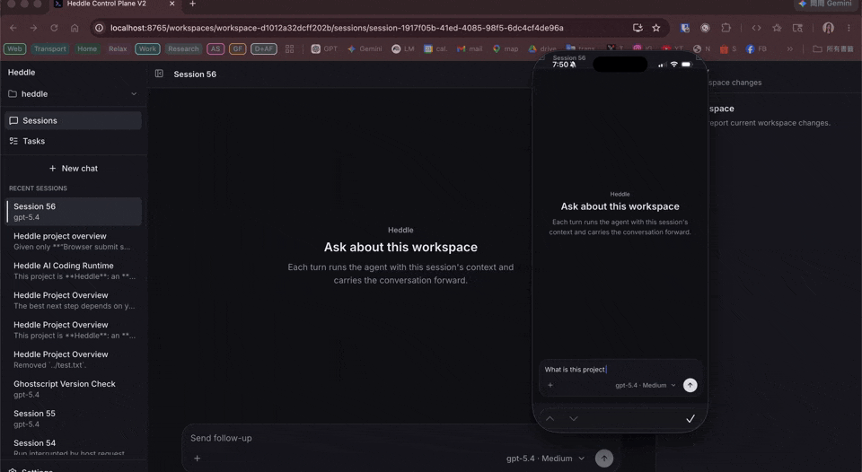
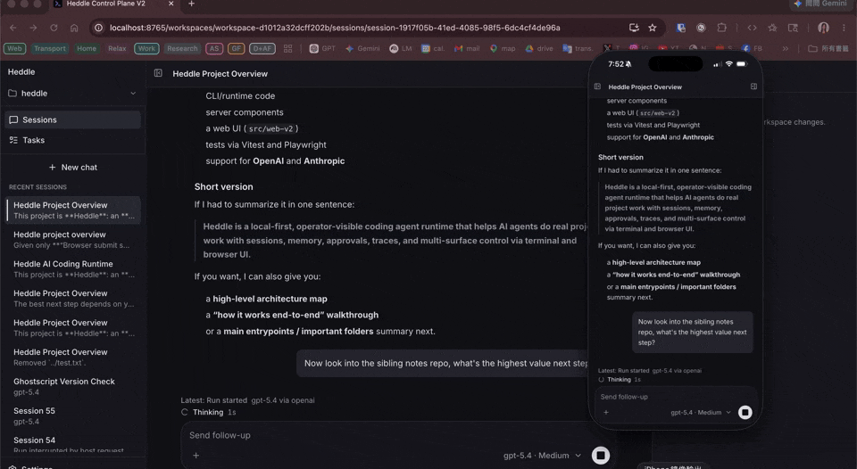
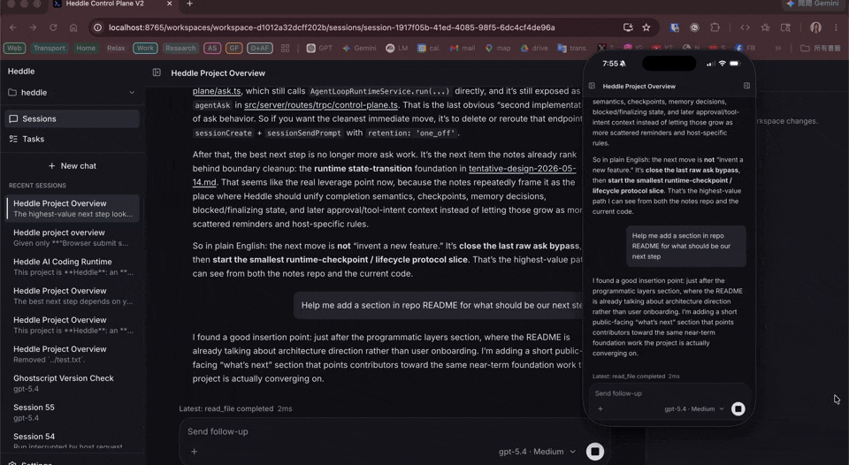

# Heddle

[English](README.md) | [繁體中文](README.zh-TW.md)

Heddle 是一個開源、本地優先、可追蹤的 coding agent harness、runtime 與 CLI，目標是讓 AI coding agent 能在真實程式碼倉庫中工作，同時保留會話、記憶、審批、traces、驗證證據與操作可見性。

官方網站：[heddleagent.com](https://heddleagent.com)

> **說明：** 這份繁體中文 README 用於快速介紹 Heddle。最新、最完整的技術細節仍以英文 README、官方文件與實際程式碼為準。

> **Terminal UI v2 已是預設介面。** 執行 `heddle` 或 `heddle chat` 會開啟 API-backed 的終端介面。訊息、run events 與 agent 回應串流會走共用的 control-plane path，因此 terminal、browser 與 mobile client 可以同時追蹤同一個工作流程。

## Heddle 解決什麼問題

Heddle 是為了「真實專案工作」設計的 coding agent runtime，而不是一次性 prompt wrapper。

它適合這類情境：

- 在陌生 repo 中快速理解架構、entrypoints、build/test 指令
- 讓 agent 在本地 workspace 裡讀檔、搜尋、修改程式碼或文件
- 對 shell command、file mutation 等敏感操作保持清楚審批流程
- 將多步驟工作保存在 session 中，之後可以繼續，不必每次從零開始
- 透過 traces、diff review、verification command evidence 檢查 agent 做了什麼
- 讓 agent 累積可審查的 workspace memory，而不是每次重新探索同樣脈絡
- 啟用標準 Agent Skills，讓 agent 只在需要時讀取可重用 workflow instructions
- 用 browser control plane 查看 sessions、current diffs、tasks、settings 與 memory 狀態
- 透過 heartbeat tasks 執行有界線的週期性或背景 agent 工作

用白話說：Heddle 是給想要 AI coding assistant 真正進入本地專案工作、但又不想把專案交給黑盒自動化的人。

## 為什麼試試 Heddle

Heddle 適合你，如果你想要：

- terminal-first 的 coding agent，可以直接在真實 repo 裡工作
- local-first 的狀態管理，sessions、traces、memory 都存在專案的 `.heddle/` 之下
- 標準 Agent Skills 支援，可以用 workspace activation 控制哪些 skills 會提供給 agent
- 明確的審批、traces、diff review 與 verification evidence
- browser control plane，用來做本地 oversight、workspace switching、session review
- 從互動式使用延伸到 programmatic use 與 scheduled/heartbeat workflows 的路徑

如果你只需要非常簡單的一次性問答工具，且不在意 sessions、memory、traces、審批或 operator control，那 Heddle 可能不是最合適的工具。

## 看 Heddle 實際運作

Terminal、browser 與 mobile 可以同時觀察同一個 live session：



在 control plane 中審核與批准敏感操作，同時保持 agent run 可見：



在 browser 或 mobile 中檢查 workspace diff，而同一個 conversation 仍持續進行：



## 兩分鐘快速開始

### 1. 安裝 Heddle

```bash
npm install -g @roackb2/heddle
```

也可以不用全域安裝，直接用：

```bash
npx @roackb2/heddle
```

### 2. 設定 provider access

OpenAI 可以使用你自己的 ChatGPT / Codex account 登入：

```bash
heddle auth login openai
```

或使用 OpenAI Platform API key：

```bash
export OPENAI_API_KEY=your_key_here
```

Anthropic 使用 API key：

```bash
export ANTHROPIC_API_KEY=your_key_here
```

如果你同時有 OpenAI OAuth credential 與 API key，可以用 `--prefer-api-key` 指定本次 run 優先使用 API key：

```bash
heddle --prefer-api-key
heddle --prefer-api-key ask "Summarize this repository"
heddle --prefer-api-key daemon
```

OpenAI account sign-in 是 experimental、由使用者自行選擇的 transport。它不是 OpenAI 官方支援；Heddle 與 OpenAI 沒有從屬、背書或贊助關係。使用 OpenAI 服務仍需遵守 OpenAI 的條款與政策。

### 3. 進入你想讓 Heddle 工作的 repo

```bash
cd /path/to/project
```

### 4. 開始 terminal chat

```bash
heddle
```

可以試試這個 prompt：

```text
Summarize this repository, show me the main build/test commands, and point out the likely entrypoints.
```

### 5. 開啟 browser control plane（可選）

```bash
heddle daemon
```

Daemon 預設會啟動本地 browser control plane。你可以在那裡查看 `Sessions`、`Tasks`、`Settings`，並檢查 active workspace、saved sessions、current diffs、memory status，或切換到另一個本地 project。

### 6. 一次性 ask 模式

如果你想要一次性 CLI run，而不是互動式 chat：

```bash
heddle ask "Summarize this repository"
```

`ask` 會在一個 prompt 後結束，但仍會把 run 存成 `.heddle/` 底下的一個 saved session，讓 traces、memory maintenance 與後續 review 能共用同一套 persisted conversation path。

## 主要功能

### Terminal chat

Heddle 的主要使用方式是在 repo 裡執行：

```bash
heddle
```

Terminal chat 可以：

- 檢查目錄與檔案
- 搜尋 repo，並尊重 ignore 規則
- 解釋程式碼與架構
- 修改程式碼或文件
- 執行 shell command，必要時要求 operator approval
- 在多輪對話中持續完成同一個任務
- 顯示 thinking、tool activity、plans、approval waits 與 assistant stream

常用 chat commands 包含：

```text
/model
/model set <query>
/reasoning
/reasoning set <query>
/skills
/skills enable <name>
/skills disable <name>
/session list
/session choose <query>
/session new [name]
/session switch <id>
/session continue <id>
/continue
/compact
/drift
!<command>
```

### Agent Skills

Heddle 支援標準 Agent Skills folder 格式，讓你把可重用 workflow instructions 放在 `SKILL.md`，不必每次 prompt 都重新貼一大段說明。

常見路徑：

```text
.agents/skills/<name>/SKILL.md
~/.agents/skills/<name>/SKILL.md
```

在 chat 裡可以用 slash commands 管理 workspace activation：

```text
/skills
/skills enable <name>
/skills disable <name>
```

只有 active skills 會提供給 agent。Heddle 會先把 active skills 的 name 與 description 放進 compact catalog；agent 只有在判斷某個 skill 相關時，才會用 `read_agent_skill` 讀取完整 `SKILL.md` 或其中 linked resources。Activation state 只存在 `.heddle/skills/activation.json`，skill definitions 仍留在原本資料夾。

Skills 是 instructions，不是 permissions。啟用 skill 不會繞過 Heddle 的 approval policy、tool safety checks、browser policy 或 workspace permissions。使用者需要自行確認放進 `.agents/skills` 或 `~/.agents/skills` 的 skills 是否可信。

更多細節請看英文文件：[Agent Skills guide](docs/guides/agent-skills.md)。

### Sessions 與 continuity

Heddle 會把 saved sessions 存在 `.heddle/` 之下，讓較長的工作不必每次重新開始。

目前 session storage 格式是：

```text
.heddle/chat-sessions.catalog.json
.heddle/chat-sessions/<session-id>.json
```

這代表你可以：

- 回到中斷的 task
- 繼續之前的 debugging thread
- 保留 project-specific context
- 透過 `/compact` 或自動 compaction 管理長對話
- 在 terminal 與 browser control plane 之間查看同一組 session record

### Workspace memory

Heddle 可以在 `.heddle/memory/` 底下維護 durable workspace knowledge。

適合放進 memory 的內容包括：

- 架構與服務邊界
- canonical build/test/release commands
- repo convention 與 workflow rule
- 使用者或團隊偏好，例如 ticket 格式、review 風格
- 已完成實作或調查後的穩定發現

Memory 是可審查的 markdown catalog，不是黑盒向量資料庫。Heddle 可以在正常工作中記錄 memory candidates，再由 bounded maintainer path 把候選內容整理進 cataloged notes。

常用 memory commands：

```bash
heddle memory status
heddle memory list
heddle memory read <path>
heddle memory search <query>
heddle memory validate
heddle memory maintain --dry-run
```

### Browser control plane

執行：

```bash
heddle daemon
```

即可啟動本地 browser control plane。它是 Heddle 的 oversight surface，用來查看：

- `Sessions`：saved conversations、assistant streaming、tool progress、approvals、current workspace diff review
- `Composer controls`：model、reasoning、drift controls、`@file` mentions、image attachments
- `Workspace switching`：註冊、重新命名、切換本地 projects
- `Tasks`：heartbeat task 的建立、編輯、啟用/停用、run、resume、delete、live run state 與 saved run records
- `Settings`：workspace management、memory status、catalog health、pending candidates
- `Mobile`：針對手機與平板的 session list、workbench、diff review 等 focused views

預設 daemon 使用同一個 local control-plane server path。Terminal、browser 與 mobile client 都可以透過這條 path 共享 session events、approval state、workspace review 與 heartbeat records。

### Heartbeat tasks

Heartbeat tasks 是有界線的週期性或背景 agent 工作。它可以：

- 載入 durable task 與 checkpoint
- 在 budget 內讓 agent 做有限工作
- checkpoint 新狀態
- 儲存 run record
- 回傳 decision：`continue`、`pause`、`complete` 或 `escalate`

常用指令：

```bash
heddle heartbeat start --every 30m --task "Check for safe repository maintenance work"
heddle heartbeat task list
heddle heartbeat run --task repo-gardener
heddle heartbeat runs show latest --task repo-gardener
```

Heartbeat task state 是 local-first 的；adding a task 只是儲存 scheduler state，不代表安裝了一個隱藏的 OS background service。

### Semantic drift（可選）

Heddle 可以搭配 optional `cyberloop` package 顯示 agent 回應是否偏離最近 conversation trajectory。

```bash
npm install -g cyberloop
```

Drift telemetry 是 observe-only，而且預設關閉。啟用時需要 OpenAI Platform API-key mode 來做 embeddings；OpenAI account sign-in 不用於 drift embeddings。

在 chat 中可以使用：

```text
/drift
/drift on
/drift off
```

## Programmatic use

Heddle 也提供可被其他 host 使用的 runtime layers：

- `createConversationEngine`：alpha API，用於 persisted multi-turn sessions、session storage、compaction、approvals、traces、semantic activity 與 custom frontends/local hosts
- `AgentLoopRuntimeService.run(...)`：較低階的 single-run execution loop，適合不需要 persisted chat/session behavior 的 host
- Heartbeat APIs：用於 scheduled/background runner cycles

如果你想把 Heddle 當成 programmatic runtime 使用，請從英文文件開始：

- [Programmatic use guide](docs/guides/programmatic-use.md)
- [Runtime host model](docs/guides/runtime-host-model.md)
- [Capabilities and tools](docs/reference/capabilities.md)

## Project instructions

Heddle 啟動時會嘗試讀取專案指令檔，讓新 session 一開始就知道 repo 的操作規則。預設優先順序：

1. `HEDDLE.md`
2. `AGENTS.md`
3. `CLAUDE.md`

預設只讀第一個非空檔案，以節省 context。如果專案需要不同路徑或多個 instruction files，可以在 `.heddle/config.json` 設定 `agentContextPaths`。

## 更多資源

- 官方網站：[heddleagent.com](https://heddleagent.com)
- npm package：[@roackb2/heddle](https://www.npmjs.com/package/@roackb2/heddle)
- GitHub Issues：[roackb2/heddle/issues](https://github.com/roackb2/heddle/issues)
- 英文文件入口：[docs/README.md](docs/README.md)
- CLI reference：[docs/reference/cli.md](docs/reference/cli.md)
- Chat and sessions：[docs/guides/chat-and-sessions.md](docs/guides/chat-and-sessions.md)
- Agent Skills：[docs/guides/agent-skills.md](docs/guides/agent-skills.md)
- Control plane：[docs/guides/control-plane.md](docs/guides/control-plane.md)

## 授權

Heddle 使用 MIT License。
