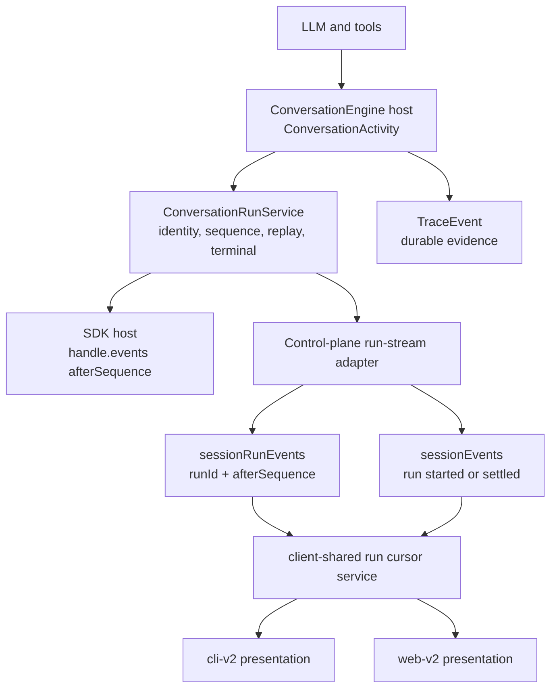

# Live Conversation Runs

This document explains how Heddle exposes one conversation run to SDK hosts,
the terminal UI, and the browser control plane. It is a maintenance map, not a
wire-protocol stability promise.

For prompt admission and accepted-message persistence, see
`docs/architecture/control-plane-chat-submission.md`. For the public run API,
see `src/core/chat/runs/README.md`.

## Goal

Every Heddle interface should experience the same run that an SDK host builds:

- one accepted run identity;
- ordered activities;
- replay from a sequence cursor after reconnect;
- one result, cancellation, or error terminal;
- exact-run cancellation and approval resolution.

The ownership split is:

- `src/core/live` owns the `ConversationActivity` vocabulary;
- `src/core/chat/runs` owns run identity, ordering, replay, terminal state,
  cancellation, and pending approval coordination;
- the control plane owns transport projection and lifecycle discovery;
- `src/client-shared` owns frontend-neutral cursor and reconnect correctness;
- CLI and web own presentation state only.

## Activity And Run Vocabularies

`ConversationActivity` describes user-facing progress. Current sources include:

- `agent-loop`: `loop.started`, `assistant.stream`, tool activity, approvals,
  plans, and `loop.finished`;
- `compaction`: compaction progress and outcomes;
- `direct-shell`: direct-shell lifecycle and results.

Activities contain enough structured information for each host to choose its
own presentation. They do not carry delivery ordering by themselves.

`ConversationRunStreamItem<Result>` is the ordered run envelope:

```ts
type ConversationRunStreamItem<Result> =
  | { kind: 'activity'; runId: string; sequence: number; timestamp: string; activity: ConversationActivity }
  | { kind: 'result'; runId: string; sequence: number; timestamp: string; result: Result }
  | { kind: 'cancelled'; runId: string; sequence: number; timestamp: string; reason: string }
  | { kind: 'error'; runId: string; sequence: number; timestamp: string; error: RunError };
```

`ConversationRunService` assigns the sequence and emits exactly one terminal.
Do not add a second activity callback or an interface-specific completion flag
alongside this stream.

## Trace Versus Activity

`TraceEvent` and `ConversationActivity` remain intentionally different:

- trace events are durable observability evidence for debugging, evals, and
  inspection;
- activities are live user-facing progress for hosts to render.

When one execution moment needs both, the owning origin emits both through the
agent live recorder helper. Shared event names live in
`src/core/event-types.ts`; avoid parallel names for the same moment.

## Flow



The main implementation path is:

- `src/core/agent` and `src/core/runtime/loop` originate agent activities;
- `src/core/chat/engine/turns/host` forwards runtime and compaction activity;
- `src/core/chat/runs/service.ts` records ordered run items and replay state;
- `chat-session-run-stream.ts` projects a core run into the public
  control-plane result shape and publishes lifecycle discovery signals;
- `chat-session-events.ts` fans lifecycle, queue, and approval signals through
  a workspace/session-scoped `EventEmitter`;
- `controlPlane.sessionRunEvents` exposes the replayable run stream;
- `ClientSharedConversationRunStreamService` enforces duplicate suppression,
  sequence-gap detection, terminal detection, and reconnect cursors;
- cli-v2 and web-v2 bind that shared behavior to their local state models.

Conversation activities are published only into `ConversationRunService`.
They are not also copied onto the session `EventEmitter`; one activity must not
arrive through two competing lanes.

## Control-Plane Streams

The control plane separates discovery and durable signals from ordered run
content.

### `controlPlane.sessionEvents`

This session-scoped lifecycle stream emits:

- `session.run.updated` with `status: 'started' | 'settled'` and the run
  reference;
- `session.approval.updated` with the current request or `null`;
- `session.queue.updated`;
- `session.updated` when persisted detail should be refreshed;
- `waiting` when the session file cannot currently be watched.

It does not carry conversation activities.

### `controlPlane.sessionRunEvents`

This is the ordered, replayable activity and terminal stream. Clients subscribe
with:

```ts
{
  workspaceId: string;
  sessionId: string;
  runId: string;
  afterSequence?: number;
}
```

The accepted prompt/direct-shell response and `session.run.updated` both expose
the run ID. A refreshed client can recover it from
`controlPlane.sessionRunState.activeRun`.

### `controlPlane.sessionsEvents`

The workspace stream carries session-list refreshes plus lifecycle signals for
sessions that are not selected. It also publishes `session.run.terminal` so a
browser can notify for background-session completion without subscribing to
every run's detailed activity.

## Examples

Run discovery:

```json
{
  "type": "session.run.updated",
  "sessionId": "session-abc",
  "timestamp": "2026-07-11T01:20:00.000Z",
  "status": "started",
  "run": {
    "runId": "run-123",
    "acceptedAt": "2026-07-11T01:20:00.000Z"
  }
}
```

Ordered assistant activity:

```json
{
  "kind": "activity",
  "runId": "run-123",
  "sequence": 2,
  "timestamp": "2026-07-11T01:20:01.000Z",
  "activity": {
    "source": "agent-loop",
    "type": "assistant.stream",
    "runId": "run-123",
    "step": 1,
    "text": "I am checking the session loader now...",
    "done": false,
    "timestamp": "2026-07-11T01:20:01.000Z"
  }
}
```

Terminal result:

```json
{
  "kind": "result",
  "runId": "run-123",
  "sequence": 9,
  "timestamp": "2026-07-11T01:20:10.000Z",
  "result": {
    "outcome": "done",
    "summary": "Updated the session loader."
  }
}
```

The control-plane result deliberately exposes only stable host-facing fields.
Internal session objects and execution arguments must not leak through the
accepted response or terminal result.

## Replay And Reconnect

The server keeps a bounded replay buffer for retained runs. A reconnecting
client sends the last accepted `sequence` as `afterSequence`; the server replays
only newer items and then resumes live delivery.

`ClientSharedConversationRunStreamService` is the mandatory CLI/web policy:

- ignore duplicate sequence numbers;
- reject a gap instead of silently losing activity;
- reconnect from the latest accepted sequence with bounded exponential delay;
- stop reconnecting once a terminal item is accepted;
- reset the cursor only when selecting a different run.

`sessionRunState` remains a refresh/recovery fallback. It must not replace the
run stream or clear a freshly accepted run from stale cached data.

## Delivery Mechanics

`RuntimeSubscriptionStream` adapts callback sources into `AsyncIterable`
subscriptions and owns buffering, pending-reader wakeup, abort cleanup, and
clean close behavior. It must not interpret conversation activities.

The Express endpoint at `/control-plane/sessions/:sessionId/events` mirrors the
session lifecycle stream for compatibility. Detailed ordered run delivery is
the tRPC `sessionRunEvents` procedure; web-v2 and cli-v2 use that path.

## Interface Responsibilities

Interfaces should:

- attach to the accepted or discovered run ID;
- reduce activity into transient streaming messages, tool status, plans, and
  approval presentation;
- treat the run terminal as the completion source of truth;
- refresh durable session state at persistence/finalization boundaries;
- target cancellation at the currently observed run ID;
- retain polling only as recovery for missed lifecycle discovery.

Interfaces should not infer run identity from an activity, declare completion
from a mutation returning, duplicate cursor/retry policy, or subscribe globally
and apply one session's activity to another selected session.

## Extending Live Runs

When adding shared behavior:

1. Add structured activity fields at the owning core origin.
2. Publish through the existing run context; do not add a second session bus.
3. Keep server projection limited to real transport/security work.
4. Put cursor and reconnect policy in `client-shared` when both interfaces need
   it.
5. Keep CLI/web differences limited to input and presentation.
6. Test run identity, ordered replay, terminal delivery, and reconnect behavior
   before relying on interface-level snapshots.
