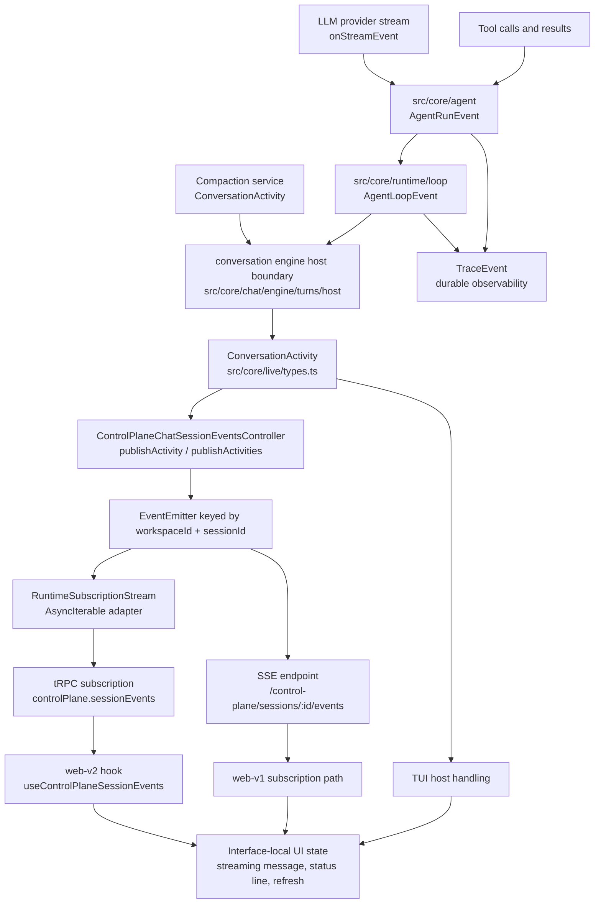

# Live Events

This document explains how Heddle streams live conversation updates from the
engine to user interfaces. It is a maintenance map, not a transport API spec.

## Goal

Live updates let interfaces show an in-progress run without polling the whole
session after every model delta or tool event.

The shared rule is:

- `src/core/live` owns the shared live event vocabulary;
- server/control-plane code owns transport fanout;
- interfaces own presentation state only.

If the same live behavior is needed by TUI, web-v1, web-v2, or a future
programmatic host, the behavior should move toward the shared live event contract
instead of being duplicated per interface.

## Vocabulary

The shared user-facing event contract is `ConversationActivity` in
`src/core/live/types.ts`.

Current activity sources are:

- `agent-loop`: run lifecycle, assistant streaming, and tool progress events
  such as `loop.started`, `assistant.stream`, `tool.calling`,
  `tool.approval_requested`, `tool.completed`, and `loop.finished`.
- `compaction`: compaction lifecycle events such as `compaction.running`,
  `compaction.finished`, and `compaction.failed`.

Activities should contain enough structured information for each interface to
render an appropriate view. Backend code should not decide display strings for
all clients. Web desktop, mobile, TUI, and programmatic consumers may present
the same activity differently.

The lower execution layers keep their own event contracts, but each layer has
one event lane:

- LLM adapters use provider stream events through `onStreamEvent`.
- `src/core/agent` emits `AgentRunEvent` through `RunAgentOptions.onEvent`.
- `src/core/runtime/loop` emits `AgentLoopEvent` through
  `RunAgentLoopOptions.onEvent`.
- `src/core/chat/engine` forwards `ConversationActivity` through
  `ConversationEngineHost.events.onActivity`.

Do not add parallel callback lanes for behavior that already belongs to the
event lane at that layer.

## Trace vs Activity

`TraceEvent` and `ConversationActivity` are intentionally different contracts:

- `TraceEvent` is durable observability evidence. It is written to run traces and
  supports debugging, evals, summaries, and system inspection.
- `ConversationActivity` is live user-facing information. It is structured for
  interfaces and programmatic hosts to render current progress without inferring
  meaning from trace internals.

Some execution moments need both. For those, the owning origin should emit both
through the agent live recorder helper, not by relying on a later mapper. For
example, tool execution records a `tool.calling` trace event and emits a
`tool.calling` conversation activity with the same canonical event name. The
only enrichment done by the runtime boundary is adding run-scoped fields such as
`runId`, `source`, and `timestamp`.

Do not introduce parallel names such as `tool.call` versus `tool.calling` for
the same moment. Shared event names live in `src/core/event-types.ts`.

## Flow



```text
LLM / tools / compaction
  -> agent events
  -> runtime loop activities, compaction activities, and durable trace evidence
  -> conversation engine host boundary
  -> ConversationActivity
  -> control-plane session publisher
  -> per-session event bus
  -> tRPC subscription or SSE endpoint
  -> interface-local state update
```

The main implementation path is:

- `src/core/agent/context/run-context-builder.ts` builds the live recorder that
  records trace evidence, emits activity, or does both for the same origin.
- `src/core/agent/model/model-turn-service.ts` receives LLM stream deltas and
  emits `assistant.stream` activity through the agent event lane.
- `src/core/agent/tools/tool-dispatcher.ts` emits tool trace and tool activity
  from the same origin so trace and activity use one vocabulary.
- `src/core/runtime/loop/service.ts` adds run-level fields and exposes runtime
  loop events.
- `src/core/chat/engine/turns/host/` forwards runtime and compaction
  activities directly. It should not infer user-facing activity from trace.
- `src/server/controllers/trpc/control-plane/chat-session-events.ts`
  publishes activity batches for one session.
- `src/server/controllers/trpc/control-plane/chat-sessions-controller.ts`
  owns in-process fanout, run cancellation state, pending approval state, and
  subscription delivery.
- `src/server/routes/trpc/control-plane.ts` exposes
  `controlPlane.sessionEvents` as a tRPC subscription.
- `src/web-v2/hooks/sessions/useControlPlaneSessionEvents.ts` consumes subscription
  events and updates web-v2 UI state.

## Control-Plane Envelopes

The server sends `ControlPlaneSessionEventEnvelope` values to browser clients:

- `session.event`: one or more `ConversationActivity` values for the selected
  session.
- `session.updated`: the persisted session file changed; the UI should refresh
  session detail, usually silently.
- `waiting`: the session file does not exist yet or cannot be watched; the UI
  can show a waiting/reconnecting state.

`session.event` is for live incremental information. `session.updated` is for
durable persisted state. Do not replace streaming with repeated full-session
refreshes; that tends to wipe transient UI state and makes the interface feel
non-streaming.

Session-list metadata changes use the separate `controlPlane.sessionsEvents`
tRPC subscription. That stream emits `sessions.updated` when the session catalog
changes, so clients can refresh sidebars without subscribing to every individual
session.

## Event Examples

These examples show the actual event shape so readers do not need to mentally
expand the TypeScript unions before changing a consumer.

Assistant streaming is delivered as a `session.event` envelope containing an
`assistant.stream` activity:

```json
{
  "type": "session.event",
  "sessionId": "session-abc",
  "timestamp": "2026-05-22T01:20:00.000Z",
  "activities": [
    {
      "source": "agent-loop",
      "type": "assistant.stream",
      "runId": "run-123",
      "step": 1,
      "text": "I am checking the session loader now...",
      "done": false,
      "timestamp": "2026-05-22T01:20:00.000Z"
    }
  ]
}
```

A tool status update keeps raw tool details available to each interface:

```json
{
  "type": "session.event",
  "sessionId": "session-abc",
  "timestamp": "2026-05-22T01:20:03.000Z",
  "activities": [
    {
      "source": "agent-loop",
      "type": "tool.calling",
      "runId": "run-123",
      "step": 1,
      "tool": "read_file",
      "toolCallId": "call-abc",
      "input": {
        "path": "src/web-v2/hooks/useControlPlaneSessionLoader.ts"
      },
      "requiresApproval": false,
      "timestamp": "2026-05-22T01:20:03.000Z"
    }
  ]
}
```

The matching durable trace event uses the same event name. It does not include
interface-only source fields:

```json
{
  "type": "tool.calling",
  "call": {
    "id": "call-abc",
    "tool": "read_file",
    "input": {
      "path": "src/web-v2/hooks/useControlPlaneSessionLoader.ts"
    }
  },
  "requiresApproval": false,
  "step": 1,
  "timestamp": "2026-05-22T01:20:03.000Z"
}
```

Approval activity is user-facing because the client needs to show that the run
is waiting for an operator decision:

```json
{
  "source": "agent-loop",
  "type": "tool.approval_requested",
  "runId": "run-123",
  "step": 1,
  "call": {
    "id": "call-def",
    "tool": "run_shell_mutate",
    "input": {
      "command": "yarn test"
    }
  },
  "timestamp": "2026-05-22T01:20:04.000Z"
}
```

A persisted session refresh is a separate envelope. It does not carry live
activity; it tells the interface to refetch durable session detail:

```json
{
  "type": "session.updated",
  "sessionId": "session-abc",
  "timestamp": "2026-05-22T01:20:10.000Z"
}
```

A waiting envelope means the subscription is established, but the session file
cannot be watched yet:

```json
{
  "type": "waiting",
  "sessionId": "session-abc",
  "timestamp": "2026-05-22T01:20:00.000Z"
}
```

## Delivery Mechanics

The control-plane controller uses an in-process `EventEmitter` keyed by
`workspaceId` and `sessionId`. This keeps a live run scoped to the session and
workspace state root that produced it, even when different workspaces contain
the same session id.

For tRPC subscriptions, `RuntimeSubscriptionStream` in
`src/core/runtime/subscriptions` adapts callbacks into an `AsyncIterable`. It is
transport infrastructure only:

- buffer events when the browser is not awaiting the next item yet;
- wake pending readers when an event arrives;
- run source cleanup and close cleanly when the subscription aborts.

It must not inspect or transform conversation activities. Event vocabulary
belongs to the conversation engine and the session event publisher.

The Express SSE endpoint at
`/control-plane/sessions/:sessionId/events` exists for browser control-plane
delivery as well. New web-v2 code should prefer the tRPC subscription path via
`@trpc/react-query` unless there is a specific transport reason not to.

## Interface Responsibilities

Interfaces may map activities to local UI state:

- append or replace a transient streaming assistant message for
  `assistant.stream`;
- show a one-line status for current tool, compaction, approval, or run state;
- refresh persisted session detail on `session.updated` or final run events;
- clear selected-session-only state when the selected session changes.

Interfaces should not:

- invent new event vocabulary for shared run semantics;
- duplicate backend policy such as run lifecycle or approval ownership;
- map one backend shape into an almost identical interface shape;
- subscribe globally and apply one session's activity to every selected
  session.

If a UI needs richer information to render a good state, add structured fields
to the owning `ConversationActivity` source instead of adding fragile client
guesswork.

## Extending Live Updates

When adding a new live behavior:

1. Decide whether it is shared conversation behavior or interface-only state.
2. If shared, add or extend `ConversationActivity` in `src/core/live/types.ts`.
3. Emit the activity at the owning runtime, engine, agent, or compaction
   boundary in that final shape. If the same moment also needs durable evidence,
   use the origin's trace+activity helper and keep the event name identical.
4. Publish through `ControlPlaneChatSessionEventsController` without remapping
   fields unless there is real transport work.
5. Add focused UI handling in the consuming interface.
6. Add a regression test that proves the live event appears before the final
   persisted refresh when streaming behavior matters.

For browser tests, the fake browser-integration agent emits a real
`assistant.stream` preview before the final fake mutation response. That path is
test infrastructure, not production behavior.
