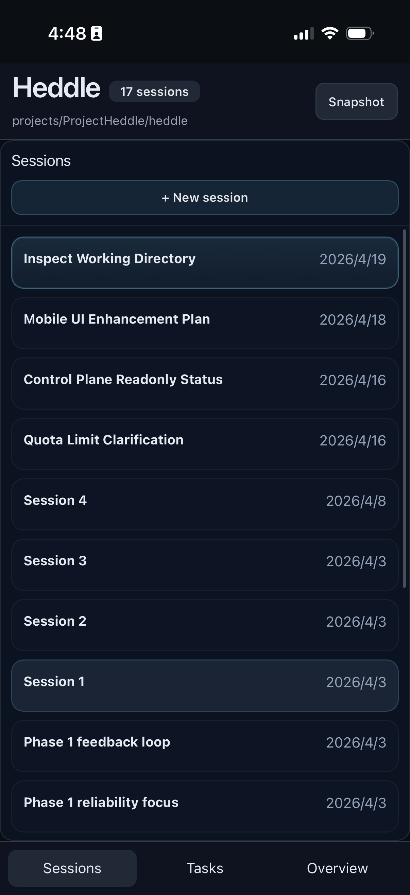
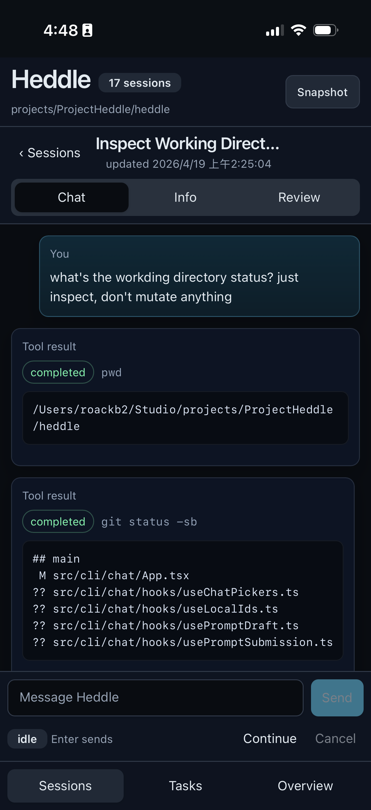
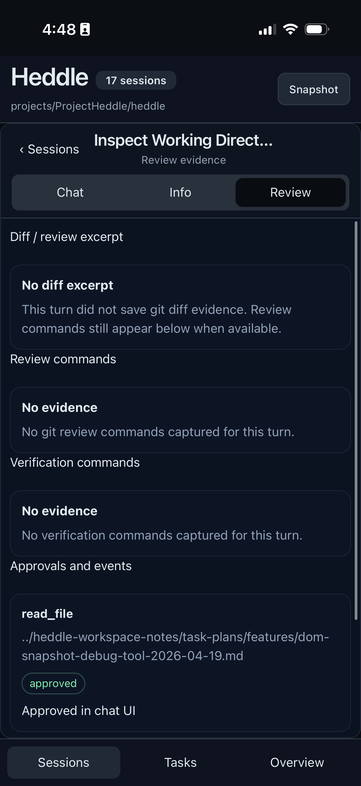

# Control Plane

Heddle includes a local browser control plane for workspace oversight when you want a native UI in addition to terminal chat.

The current control plane is still early, but it has moved beyond a placeholder dashboard into a workstation-style local UI for inspecting sessions, review evidence, heartbeat tasks, and run history.

## What The Control Plane Includes

Current stack:

- `src/server`: Express-hosted tRPC server
- `src/web`: React/Vite web client
- `src/server/features/control-plane`: control-plane-specific server feature logic
- pino logs written locally for debugging

The current browser UI surfaces:

- workspace and `.heddle/` state location
- saved chat sessions with sidebar navigation, resizable desktop panels, conversation view, and review-oriented detail inspection
- browser-side session actions for new session, send, continue, cancel, and pending approval resolution
- live per-session updates over SSE for run status, tool progress, assistant streaming text, and saved-session changes
- a model selector backed by the server-side built-in model catalog, plus a drift toggle and latest trace-derived drift level
- debounced `@file` mention suggestions in the composer, backed by a capped workspace file search endpoint
- compact tool-result cards for saved tool outputs such as `list_files: {...}`
- lightweight toast notifications for session/action success and failure
- heartbeat task status, scheduling state, selected task detail, and run history
- recent heartbeat run summaries and usage data

## Mobile Layout

The control plane includes a mobile-native layout for phone and tablet access. It is designed around short navigation paths rather than shrinking the desktop workstation view into a narrow screen.

On mobile, the UI uses:

- bottom root navigation for Sessions, Tasks, and Overview
- a dedicated session list for choosing saved conversations
- native-style session navigation for Chat, Info, and Review
- a compact composer that keeps the latest conversation visible
- reachable session review and approval evidence without desktop sidebars

Representative mobile views:

<p>
  
  
  
</p>

## Start The Daemon

Start the daemon from a workspace:

```bash
heddle daemon
```

By default, the daemon binds to `127.0.0.1:8765` and serves the built web app plus the tRPC API.

You can override host and port:

```bash
heddle daemon --host 127.0.0.1 --port 8765
```

The server writes pino logs to `.heddle/logs/server.log` by default. Override the path with:

```bash
HEDDLE_SERVER_LOG_FILE=/path/to/server.log heddle daemon
```

## Development Mode

For local development, run the server and client separately:

```bash
yarn server:dev
yarn client:dev
```

`yarn server:dev` starts the backend API server only at `127.0.0.1:8765`. It does not serve the web app shell at `/`.

`yarn client:dev` starts the Vite web client at `127.0.0.1:5173` and proxies `/trpc` and `/control-plane` requests to the backend server.

In other words:

- development mode uses two services:
  - backend API on `8765`
  - Vite frontend on `5173`
- built daemon mode uses one service:
  - `heddle daemon` serves both the built web client and the backend API on the same port

For built/local operator usage inside this repository, run:

```bash
yarn build
node dist/src/cli/main.js daemon --host 127.0.0.1 --port 8765
```

If you add or change control-plane tRPC routes, restart the daemon or backend server process. Vite hot reload updates the browser bundle only; a still-running daemon will not know about new procedures and may return `No procedure found on path ...`.

## Remote Control With Tailscale

If you want to access the control plane from another laptop, phone, or tablet, Tailscale is the recommended local-first remote access path.

### Why Tailscale

Tailscale lets you keep Heddle running on your workstation while reaching it from your other devices over a private tailnet. This avoids exposing the daemon directly to the public internet.

### Recommended Setup

1. Run the daemon locally:

```bash
yarn build
node dist/src/cli/main.js daemon --host 127.0.0.1 --port 8765
```

2. Put Tailscale Serve in front of it:

```bash
tailscale serve --bg http://127.0.0.1:8765
```

3. Check the active Serve status:

```bash
tailscale serve status
```

You should see an HTTPS `*.ts.net` URL that proxies to `http://127.0.0.1:8765`.

4. Open that HTTPS `*.ts.net` URL from another device on your tailnet.

### Important Notes

- For home-screen or app-like use on iPhone, use the HTTPS `*.ts.net` hostname, not a raw `http://100.x.x.x:8765` Tailscale IP.
- If you previously saved a home-screen icon from an HTTP URL, delete it and re-add it from the HTTPS hostname.
- `tailscale serve --bg http://127.0.0.1:8765` publishes the daemon inside your tailnet. You do not need Funnel for ordinary private remote control.
- If port `8765` is already in use, stop the old process or use another port and update the Serve target accordingly.

### Example Flow

```bash
yarn build
node dist/src/cli/main.js daemon --host 127.0.0.1 --port 8765
tailscale serve --bg http://127.0.0.1:8765
tailscale serve status
```

Then open the reported `https://<machine-name>.<tailnet>.ts.net` URL.

## Current Status

The control plane is still early and not yet a full IDE-like browser-native operator surface. Current strengths are browser-based session control, session review, and heartbeat visibility. Current limitations are richer diff/file review, broader heartbeat mutations, and general UI polish.

## See Also

- [Chat and sessions](chat-and-sessions.md)
- [Heartbeat guide](heartbeat.md)
- [CLI reference](../reference/cli.md)
