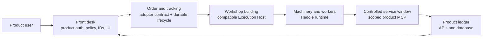
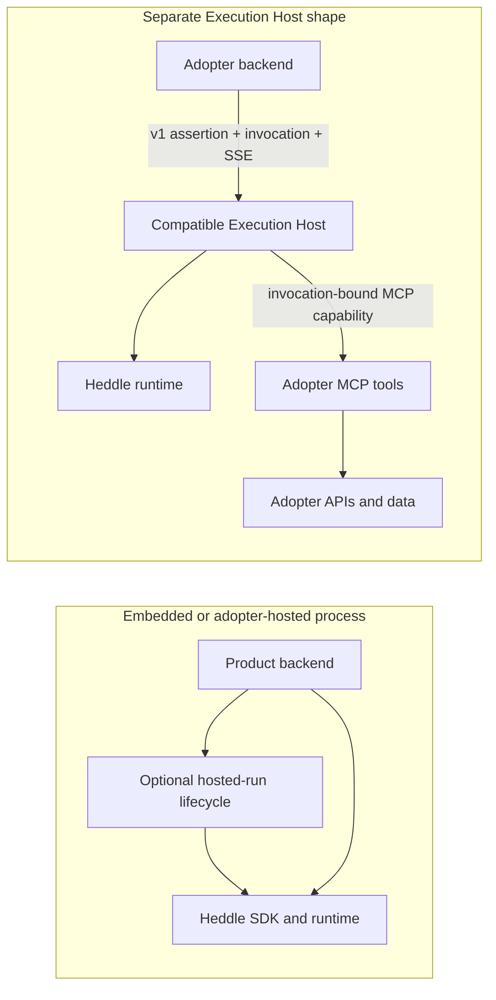

# Heddle Component and Deployment Model

Heddle can run inside a product backend or behind a separate Execution Host.
The agent loop is the same kind of runtime in both shapes; the deployment and
trust boundaries are different.

## Start with the workshop model

Imagine that your product operates a workshop:

- your **product backend is the front desk**: it knows the customer, decides
  what they may request, owns the ledger, and presents the result;
- the **Heddle adopter layer is the secure order and tracking system**: it
  carries signed scope, submits work, enforces the durable lifecycle, and
  reports one truthful terminal outcome;
- the **Execution Host is the workshop building**: an isolated place where the
  work runs without receiving keys to the product database;
- the **Heddle runtime is the machinery and workers** inside that building:
  models, tools, conversations, approvals, traces, artifacts, and workspace;
  and
- the product's **MCP endpoint is a controlled service window**: the workshop
  can request only the product capabilities authorized for that invocation.

This model answers the most important ownership question. The product owns its
record and database, but it should not reimplement a generic lifecycle state
machine. Heddle defines **what** `requested`, `running`, terminal,
interruption, and expiry mean and **when** each checkpoint must commit. The
product supplies the atomic database adapter and decides **which** records a
user may query and **how** the UI presents them.

This distinction matters because three similar terms describe different
things:

- the **Heddle runtime** is the model, tool, conversation, approval, trace, and
  artifact machinery shipped by `@roackb2/heddle`;
- **hosted runs** are public lifecycle utilities for addressable, reconnectable
  runs inside an adopter-owned long-lived Node process, shipped at
  `@roackb2/heddle/hosted`; and
- a **Heddle Execution Host** is a separately deployed application that embeds
  the Heddle runtime and is invoked through a language-neutral network
  contract.

“Hosted” in a package path does not mean Heddle operates a cloud service.
Similarly, the Heddle runtime is application code and should not be confused
with a cloud provider product such as AWS AgentCore Runtime.

## Choose one primary shape

| Shape | Where Heddle runs | Start with | Best fit |
| --- | --- | --- | --- |
| Embedded SDK | In your TypeScript/Node backend | `@roackb2/heddle` | The backend may import Heddle and should directly own tools, storage adapters, policy, and UI integration |
| Adopter-hosted run service | In your long-lived TypeScript/Node server or worker | `@roackb2/heddle/hosted`, optionally `@roackb2/heddle-remote` | A turn must outlive one request, support reconnect/cancel, or stream to another process while remaining inside your deployment |
| Separate Execution Host | In an independently deployed compatible host | `@roackb2/heddle-adopter` or the published OpenAPI/JSON Schema contract | The product backend uses another language or needs the agent workstation isolated from product data and infrastructure |
| Heddle coding agent | In the local CLI, daemon, and browser control plane | `heddle` | You want to use or inspect Heddle as a finished coding-agent product before embedding the SDK |

The first two shapes are normal public SDK integration. The third is a public
adopter contract plus reference machinery; it is not a publicly distributed
Execution Host or a Heddle-operated service.

## Dependency and trust boundaries

In the separate-host shape, only the Execution Host imports Heddle. The adopter
backend can use any language that implements the published contract. It owns
end-user authentication, authorization, tenant mapping, durable invocation
identity, signing-key operations, product MCP behavior, the atomic lifecycle-
store adapter/schema/migrations, history queries, retention, result
application, and product data. The adopter lifecycle owns the generic state
machine over that store. The Execution Host receives short-lived authority and
the exact MCP capability selected for one invocation; it should not receive an
adopter database credential.

## Package relationships

| Surface | Use it when | Important boundary |
| --- | --- | --- |
| `@roackb2/heddle` | Heddle runs inside a TypeScript/Node process | This is the supported runtime and SDK |
| `@roackb2/heddle/hosted` | That same Node process needs addressable runs, replay, cancel, or reconnect | This is an in-process run service, not the separate Execution Host |
| `@roackb2/heddle-remote` | A browser or JavaScript client consumes hosted-run envelopes | It consumes execution; it does not run an agent |
| `@roackb2/heddle-postgres` | Heddle heartbeat tasks need PostgreSQL leases, checkpoints, and history | It is heartbeat-specific, not a general product DB or conversation-history adapter |
| `@roackb2/heddle-adopter` | A product invokes a separate compatible Execution Host | TypeScript gets supported authority, transport, lifecycle, Node, and testing helpers; every backend can use the v1 artifacts |
| v1 OpenAPI, JSON Schema, and fixtures | The adopter backend is Python, Go, Java, or another stack | Implement the network and optional durable-lifecycle profiles; never port Heddle's agent loop |

The embedded runtime promise and the separate-host portability promise are
different. Heddle's maintained embedded runtime is TypeScript/Node. The
separate-host v1 network and durable-lifecycle profiles are language-neutral.
The checked-in Python implementation proves that a second language can conform;
it is version-pinned reference material, not a published or supported Python
SDK and not a promise to mirror every TypeScript convenience.

## Public availability

| Component | Status | What the status means |
| --- | --- | --- |
| `@roackb2/heddle` and `/hosted` | Public | TypeScript/Node SDK and runtime surfaces for adopter-owned processes |
| `@roackb2/heddle-remote` | Public | Browser-safe run protocol and optional HTTP/SSE client |
| `@roackb2/heddle-adopter` | Public, experimental | Supported TypeScript adopter helpers plus canonical OpenAPI, JSON Schema, wire/lifecycle fixtures, store conformance, and an independent Python v1 conformance proof |
| Compatible Heddle Execution Host | Private research | A proving ground for isolated hosted execution and deployment evidence; it is not distributed or offered as a service |
| AWS AgentCore deployment | Private research target | One way to test managed session isolation and lifecycle behavior, not a requirement of the public contract |

The public claim is deliberately bounded: Heddle defines and tests how a
language-neutral adopter integrates with a compatible Execution Host. It does
not claim that a managed Heddle hosting product is available.

## Continue by goal

- Embed the runtime: [SDK quickstart](quickstart.md).
- Choose the narrowest in-process layer:
  [programmatic integration layers](integration-layers.md).
- Build reconnectable runs in your own server:
  [hosted agent stack](../../../examples/sdk/05-hosted-agent/README.md).
- Integrate a backend with a separate host:
  [Execution Host adopter backend](execution-host-adopters.md).
- Implement the network contract outside TypeScript:
  [v1 language-neutral specification](../../../packages/heddle-adopter/spec/v1/README.md).
