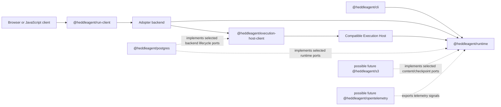

# Heddle Package Family

Status: **two private v6 foundations and three stable packages**

This directory records the v6 package identities and responsibility boundaries.
`@heddleagent/execution-host-client@6.0.0` contains its canonical
implementation as a stable package. `@heddleagent/postgres@6.0.0` ships the
first official v6 database adapter. `@heddleagent/run-client@6.0.0` ships the
existing browser-safe run client under its final coordinate. The other two `@heddleagent/*`
directories remain private metadata-only foundations. Existing
`@roackb2/*` packages remain supported until each replacement is independently
verified and released.

## Initial v6 family

| Package | Responsibility | Migration status |
| --- | --- | --- |
| `@heddleagent/runtime` | Embeddable TypeScript/Node agent runtime and SDK | Private foundation; implementation remains in `@roackb2/heddle` |
| `@heddleagent/cli` | Installable Heddle coding-agent product and `heddle` executable | Private foundation; implementation remains in `@roackb2/heddle` |
| `@heddleagent/run-client` | Browser-safe JavaScript run protocol consumer | Existing implementation activated at stable `6.0.0` |
| `@heddleagent/execution-host-client` | Product-backend contracts and helpers for invoking a separate compatible Execution Host | Canonical implementation moved; stable version `6.0.0` |
| `@heddleagent/postgres` | Official PostgreSQL implementations for supported Heddle-owned durable ports | Stable `6.0.0`; first entrypoint implements the Execution Host conversation lifecycle; heartbeat remains in `@roackb2/heddle-postgres` until its separate migration |

The in-process run service will be exposed from
`@heddleagent/runtime/runs`; it is not a sixth package. Its conventional Node
transport helpers will live under `@heddleagent/runtime/runs/http-sse`.
Likewise, `@heddleagent/run-client/http-sse` is a subpath of the browser-safe
client package.

## Naming rule: purpose for contracts, technology for adapters

Heddle names a domain contract after the behavior it guarantees and names a
concrete adapter package after the technology it actually operates:

| Layer | Naming style | Examples |
| --- | --- | --- |
| Domain capability or port | Purpose and semantics | `ConversationPersistence`, `ChatSessionRepository`, `HeartbeatTaskStore`, hosted conversation lifecycle |
| Adapter package | Concrete backend or standard | `@heddleagent/postgres`; possible future `@heddleagent/s3` or `@heddleagent/opentelemetry` packages |
| Adapter subpath | Domain purpose implemented with that backend | `@heddleagent/postgres/conversations`, `/heartbeat`, or `/execution-host/conversations` |

Concrete implementation symbols are technology-qualified as well: for
example, `ChatSessionRepository` can be implemented by
`FileChatSessionRepository` or a future `PostgresChatSessionRepository`, while
`HeartbeatTaskStore` is currently implemented by file and PostgreSQL task
authorities. The port does not change when the backend changes.

A package named `transactional-storage` would hide the database, driver,
migration, and operational compatibility that adopters must choose. PostgreSQL,
MySQL, SQLite, and a workflow engine do not become interchangeable merely
because they can all store records. Conversely, a provider-neutral interface
named `PostgresStore` would incorrectly leak one implementation into the
domain. Purpose belongs at the port; technology belongs at the leaf adapter.

Do not add a universal `@heddleagent/storage`, `@heddleagent/persistence`, or
`@heddleagent/aws` implementation package. Runtime and Execution Host packages
own their domain ports and conformance. Concrete leaf packages may implement
selected ports without becoming the authority for unrelated state. A future
adapter package is created only after its first supported entrypoints and
acceptance tests are selected; speculative package skeletons are unnecessary.

## Dependency direction

- `@heddleagent/cli` may depend on `@heddleagent/runtime`; the runtime never
  depends on the CLI.
- `@heddleagent/run-client` stays browser-safe and does not import the runtime
  or an agent loop.
- `@heddleagent/execution-host-client` runs in the product backend. It does not
  contain the compatible Execution Host or import the runtime.
- `@heddleagent/postgres` implements ports owned by their domain packages. No
  runtime or client package depends on PostgreSQL.
- Future adapter packages follow the same one-way dependency rule. They are not
  part of the initial release merely because their names appear in this design.

## Foundation and activation rules

The runtime and CLI directories contain only a manifest, boundary
README, and repository license. Their manifests have
`private: true`, have no exports or dependencies, and cannot be published.
The run client, Execution Host client, and PostgreSQL adapter family are activated
exceptions with independent builds and guarded stable releases. PostgreSQL
exports only its implemented Execution Host lifecycle entrypoint.

Run `yarn package-family:verify` to enforce all of the following:

- exactly the five selected package identities exist;
- two foundations remain private at version `0.0.0` and implementation-free;
- all three activated packages have exact reviewed stable manifests, dependency
  boundaries, exports, source ownership, and release tags;
- package licenses and repository metadata remain consistent; and
- the two remaining local v5 package identities stay present, while the
  published former adopter and remote-client tarballs remain installable
  during migration.

Each further activation preserves one canonical code path, the existing build,
and one packed-consumer smoke. Do not create file dependencies, duplicate
implementations, or introduce a workspace/build-tool migration merely to make
an empty package installable.
