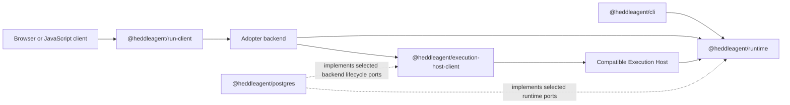

# Heddle Package Family

Status: **v6 package foundation; no `@heddleagent/*` package is published yet**

This directory records the approved v6 package identities and responsibility
boundaries before code moves between artifacts. The current `@roackb2/*`
packages remain the only installable and supported packages until a coordinated
migration is built, verified, and released.

## Planned v6 family

| Package | Responsibility | Current source surface |
| --- | --- | --- |
| `@heddleagent/runtime` | Embeddable TypeScript/Node agent runtime and SDK | Runtime and SDK portions of `@roackb2/heddle` |
| `@heddleagent/cli` | Installable Heddle coding-agent product and `heddle` executable | CLI, daemon, and browser control plane portions of `@roackb2/heddle` |
| `@heddleagent/run-client` | Browser-safe JavaScript run protocol consumer | `@roackb2/heddle-remote` |
| `@heddleagent/execution-host-client` | Product-backend contracts and helpers for invoking a separate compatible Execution Host | `@roackb2/heddle-adopter` |
| `@heddleagent/postgres` | Official PostgreSQL implementations for supported Heddle-owned durable ports | `@roackb2/heddle-postgres`, expanded by an explicit support matrix |

The in-process run service will be exposed from
`@heddleagent/runtime/runs`; it is not a sixth package. Its conventional Node
transport helpers will live under `@heddleagent/runtime/runs/http-sse`.
Likewise, `@heddleagent/run-client/http-sse` is a subpath of the browser-safe
client package.

## Dependency direction

- `@heddleagent/cli` may depend on `@heddleagent/runtime`; the runtime never
  depends on the CLI.
- `@heddleagent/run-client` stays browser-safe and does not import the runtime
  or an agent loop.
- `@heddleagent/execution-host-client` runs in the product backend. It does not
  contain the compatible Execution Host or import the runtime.
- `@heddleagent/postgres` implements ports owned by their domain packages. No
  runtime or client package depends on PostgreSQL.

## Foundation rules

Each new package directory currently contains only a manifest, boundary
README, and repository license. Its manifest has `private: true`, has no
exports or dependencies, and cannot be published. This is deliberate: a
package name must not imply that an implementation or support promise exists.

Run `yarn package-family:verify` to enforce all of the following:

- exactly the five approved `@heddleagent/*` package identities exist;
- all five remain private at version `0.0.0`;
- no implementation, dependency, export, binary, or publish configuration has
  entered a foundation package;
- package licenses and repository metadata remain consistent; and
- the current `@roackb2/*` release packages remain present during migration.

Adding implementation requires a separately reviewed migration that moves one
canonical code path, adds real build and package tests, and removes the old
source ownership. Do not create file dependencies, duplicate implementations,
or introduce a workspace/build-tool migration merely to make an empty package
installable.
