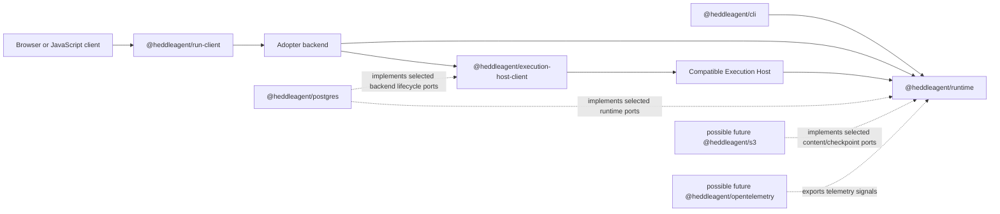

# Heddle Package Family

Status: **five stable packages**

This directory records the v6 package identities and responsibility boundaries.
`@heddleagent/execution-host-client@6.1.0` contains its canonical
implementation as a stable package. `@heddleagent/postgres@6.1.0` ships the
Execution Host lifecycle and heartbeat adapters. `@heddleagent/run-client@6.0.0`
ships the existing browser-safe run client under its final coordinate.
`@heddleagent/runtime@6.1.0` ships the existing embeddable SDK and the bridge
used by the official CLI. `@heddleagent/cli@6.0.0` ships the existing `heddle`
command, TUI, daemon, and browser control plane. The former `@roackb2/*`
coordinates are deprecated and remain installable only so existing applications
keep running; new integrations should use the `@heddleagent/*` packages.

## Initial v6 family

| Package | Responsibility | Migration status |
| --- | --- | --- |
| `@heddleagent/runtime` | Embeddable TypeScript/Node agent runtime and SDK | Stable `6.1.0`; `/runs` replaces the former `/hosted` package-path name and `/cli` is the package-to-package bridge for the official CLI |
| `@heddleagent/cli` | Installable Heddle coding-agent product and `heddle` executable | Existing CLI, TUI, daemon, and browser control plane activated at stable `6.0.0` |
| `@heddleagent/run-client` | Browser-safe JavaScript run protocol consumer | Existing implementation activated at stable `6.0.0` |
| `@heddleagent/execution-host-client` | Product-backend contracts and direct/AgentCore clients for invoking a separate compatible Execution Host | Stable `6.1.0`; official AgentCore transport at `/agentcore` |
| `@heddleagent/postgres` | Official PostgreSQL implementations for supported Heddle-owned durable ports | Stable `6.1.0`; Execution Host conversation lifecycle and heartbeat task authority are explicit subpaths |

The in-process run service is exposed from
`@heddleagent/runtime/runs`; it is not a sixth package. Its conventional Node
transport helpers live under `@heddleagent/runtime/runs/http-sse`.
Likewise, `@heddleagent/run-client/http-sse` is a subpath of the browser-safe
client package.

## Naming rule: purpose for contracts, technology for adapters

Heddle names a domain contract after the behavior it guarantees and names a
concrete adapter package after the technology it actually operates:

| Layer | Naming style | Examples |
| --- | --- | --- |
| Domain capability or port | Purpose and semantics | `ConversationPersistence`, `ChatSessionRepository`, `HeartbeatTaskStore`, hosted conversation lifecycle |
| Adapter package | Concrete backend or standard | `@heddleagent/postgres`; possible future `@heddleagent/s3` or `@heddleagent/opentelemetry` packages |
| Adapter subpath | Domain purpose implemented with that backend | `@heddleagent/postgres/conversations`, `/heartbeat`, or `/execution-host/conversations` |

Concrete implementation symbols are technology-qualified as well: for
example, `ChatSessionRepository` can be implemented by
`FileChatSessionRepository` or a future `PostgresChatSessionRepository`, while
`HeartbeatTaskStore` is currently implemented by file and PostgreSQL task
authorities. The port does not change when the backend changes.

A package named `transactional-storage` would hide the database, driver,
migration, and operational compatibility that adopters must choose. PostgreSQL,
MySQL, SQLite, and a workflow engine do not become interchangeable merely
because they can all store records. Conversely, a provider-neutral interface
named `PostgresStore` would incorrectly leak one implementation into the
domain. Purpose belongs at the port; technology belongs at the leaf adapter.

Do not add a universal `@heddleagent/storage`, `@heddleagent/persistence`, or
`@heddleagent/aws` implementation package. Runtime and Execution Host packages
own their domain ports and conformance. Concrete leaf packages may implement
selected ports without becoming the authority for unrelated state. A future
adapter package is created only after its first supported entrypoints and
acceptance tests are selected; speculative package skeletons are unnecessary.

## Dependency direction

- `@heddleagent/cli` may depend on `@heddleagent/runtime`; the runtime never
  depends on the CLI.
- `@heddleagent/run-client` stays browser-safe and does not import the runtime
  or an agent loop.
- `@heddleagent/execution-host-client` runs in the product backend. It does not
  contain the compatible Execution Host or import the runtime.
- `@heddleagent/postgres` implements ports owned by their domain packages. No
  runtime or client package depends on PostgreSQL.
- Future adapter packages follow the same one-way dependency rule. They are not
  part of the initial release merely because their names appear in this design.

## Legacy coordinates

The `@roackb2/heddle`, `@roackb2/heddle-remote`, and
`@roackb2/heddle-adopter`, and `@roackb2/heddle-postgres` packages are
deprecated. They are not the starting point for new applications and do not
receive a new v5 release line. Existing published versions remain on npm so
already-installed applications continue to resolve them.

The heartbeat PostgreSQL implementation now lives only under
`@heddleagent/postgres/heartbeat`. The deprecated package's source directory is
removed from the active repository; its historical source remains recoverable
from the `v5.13.0` tag.
