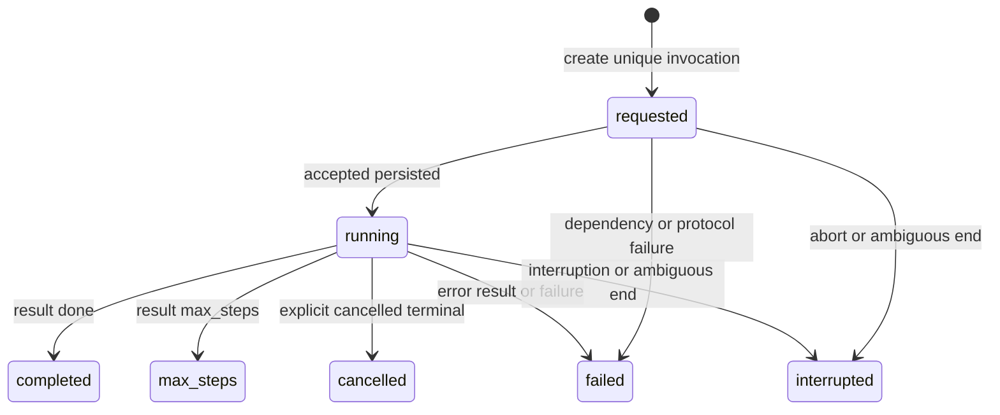

# Durable hosted-conversation lifecycle profile v1

This optional profile defines the adopter-side state machine around one
`conversation-turn` invocation. It is language-neutral even though the
supported TypeScript SDK supplies the ready-made service. Other languages can
implement the same behavior against their own database by using the published
schemas and `fixtures/durable-conversation-lifecycle.json`.

The profile does not move product data into Heddle. The adopter remains the
owner of the record, database, authenticated scope, retention, history query,
and UI. Heddle owns the correctness-sensitive transition and stream-ordering
rules that should not be independently reinvented by every product.

## Participants

1. **Product admission** authenticates the caller and selects `tenantId`,
   `subjectId`, `productSessionId`, `runtimeSessionId`, a unique
   `invocationId`, prompt, and optional deadline.
2. **Lifecycle service** persists safe checkpoints around an already-composed
   conversation-turn runner.
3. **Lifecycle store** implements atomic, scope-fenced transitions in the
   adopter's database.
4. **Execution runner** issues authority, invokes the Execution Host, and
   returns the validated v1 event stream.

Only the Execution Host imports the Heddle runtime in a separate-host
deployment. The adopter lifecycle service is control-plane code and never
receives the host workspace or Heddle's private trace state.

## State machine

`completed`, `max_steps`, `failed`, `cancelled`, and `interrupted` are terminal
and immutable. A terminal write can be repeated only when every persisted
field, including `settledAt`, is identical.

### Store transition rules

- `createTurn` rejects every duplicate `invocationId`, including an identical
  request. This prevents a repeated product request from starting execution
  twice.
- Every later mutation is fenced by `invocationId` and the complete tenant,
  subject, and product-session scope.
- `recordAccepted` changes `requested` to `running`. An exact repeat with the
  same `runId` and `acceptedAt` is idempotent while the row is running.
- Before acceptance, only `failed` or `interrupted` can settle the row.
- After acceptance, any defined terminal status can settle the row.
- A wrong-scope, conflicting, or late transition fails atomically. It must not
  silently update zero rows and report success.
- Expiry reconciliation changes only open `requested` or `running` rows in the
  supplied scope whose `deadlineAt` is earlier than `expiredBefore`. It records
  `interrupted/deadline_elapsed` and never overwrites a terminal row.

The published TypeScript conformance helper and Python reference tests execute
these rules. A real adapter must run them against its actual transactional
store, not only an in-memory substitute.

## Persistence-before-delivery ordering

The lifecycle service observes this order:

1. validate normalized product input;
2. persist `requested`;
3. start the execution runner;
4. persist `running` before releasing `accepted`;
5. pass through bounded public activity without persisting it;
6. project and persist a terminal before releasing that terminal; and
7. settle an open row as interrupted when the stream throws, ends ambiguously,
   or is closed by its consumer.

If requested persistence fails, execution does not start. If accepted
persistence fails, `accepted` is not released. If terminal persistence fails,
the terminal is not released. A possibly committed write is not blindly
retried or overwritten; an open row remains eligible for later reconciliation.

The runner must emit one `accepted` event before activity or a terminal. A
terminal is trustworthy only after the underlying v1 HTTP body reaches clean
EOF. Duplicate acceptance, terminal-before-acceptance, missing terminal, and
post-terminal data are protocol failures or ambiguous interruption, never
success.

## Terminal projection

The durable projection uses the closed statuses and failure codes in the
published schema bundle and golden fixture. Important distinctions are:

- only an explicit `cancelled` terminal becomes `cancelled`;
- request abort, client disconnect, server shutdown, task cancellation, and
  local invocation cancellation become `interrupted/invocation_aborted`;
- clean EOF without a terminal becomes
  `interrupted/stream_ended_without_terminal`;
- transport loss becomes `interrupted/stream_interrupted`;
- arbitrary host error codes and messages become the fixed durable code
  `execution_error`;
- model failures map only through the fixed public model-code allowlist; and
- unknown thrown errors become `failed/execution_failed` without storing their
  messages or types.

Summary bounds count Unicode code points, not UTF-8 bytes or UTF-16 code units.
The exact same bounded summary is released live and sent to the store, so a
reload cannot silently show different content from the live turn.

## Data allowed across the store port

The lifecycle store may receive only:

- authorized tenant, subject, and product-session scope;
- invocation ID, prompt, optional deadline, and lifecycle timestamps;
- accepted run ID; and
- bounded terminal summary and a closed failure code.

It must never receive activity, tool arguments or results, hidden reasoning,
raw errors, provider-selected error text, model credentials, execution
assertions, MCP capabilities, JWTs, traces, or workspace contents.

## Reconciliation and recovery limit

Reconciliation needs a product deadline. A turn without `deadlineAt` is not
expired by this profile because Heddle cannot invent the product's maximum run
time. Adopters that require crash convergence should always supply a deadline
and invoke scoped reconciliation while open rows are visible or from their
existing scheduler.

This profile deliberately does not define result lookup, stream reconnect,
replay, automatic retry, billing, history-list limits, or UI polling. Ambiguous
execution is recorded as interrupted and is never automatically rerun. A
future lookup/reconnect protocol requires its own explicit contract decision.
