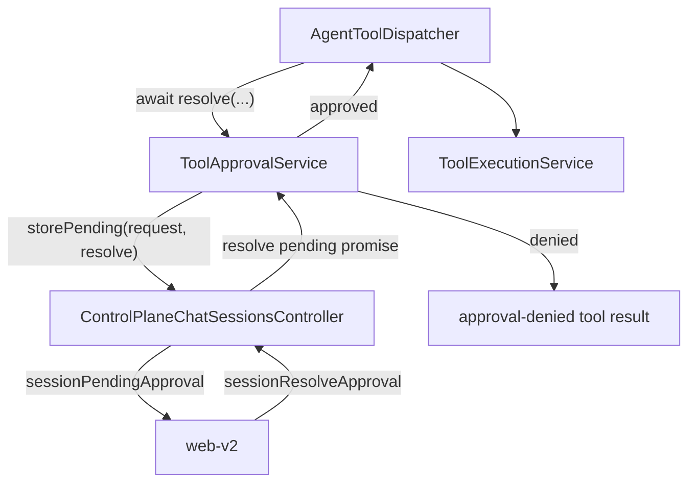

# Approvals

The approvals domain owns approval policy, remembered approval rules, approval
requests, and host approval surfaces.

## Owns

- Approval request and decision types.
- Ordered approval policy chains.
- Remembered project/user approval rules.
- Host approval surface interfaces.
- Approval-related trace/event helpers.

## Does Not Own

- Tool execution itself.
- TUI modals, Ink pending approval state, or browser pending approval UI.
- Shell command execution.
- Session persistence.

## Current Source Locations

Approval behavior currently exists in these places:

- `src/core/agent/tools/tool-dispatcher.ts`
- `src/core/approvals/service.ts`
- `src/core/approvals/policies.ts`
- `src/core/approvals/remembered-rules/`
- `src/cli/chat/hooks/controllers/run/tui-tool-approval.ts`
- `src/server/features/control-plane/controllers/chat-sessions-controller.ts`
- `src/server/features/control-plane/controllers/chat-session-events.ts`

## Public Entry Points

- `types.ts`: approval request, decision, policy, and surface types.
- `service.ts`: `ToolApprovalService` ordered policy evaluation,
  request-to-human approval resolution, approval request view construction,
  edit previews, and remembered project approval rule application.
- `policies.ts`: `ToolApprovalPolicies` built-in tool, workspace-boundary,
  remembered-rule, and human-surface policy constructors.
- `remembered-rules/`: project approval rule service, repository, codec,
  schemas, and types. The repository is an internal storage boundary for
  `ToolApprovalService`; host/controller code must not import it directly.

## Runtime Flow

Tool approval starts in the agent tool dispatcher, not in a host UI:

```text
AgentToolDispatcher
  -> ToolApprovalService.resolve(...)
  -> ToolApprovalPolicies.default() and host-supplied policies
  -> requestHumanApproval(...) only when policy resolution requires a person
  -> host/controller displays ToolApprovalRequest and resolves the pending promise
  -> ToolApprovalService.resolveUserDecision(...)
  -> tool execution continues or receives an approval-denied tool result
```

`ToolApprovalService` owns the host-neutral request shape. A request includes
the tool name, call id, raw input, requested timestamp, compact summary, policy
reason, optional edit preview, and optional remembered project approval metadata.
Hosts should render that request as-is and return a `ToolApprovalUserDecision`.
Hosts should not rebuild summaries, create remembered rules, read/write the
approval rules file, or call `previewEditFileInput` for approval UI.

The "blocking" mechanism is a normal awaited promise. The resolver for that
promise is handed to the host/controller and stored in host-local pending state.
Until a user action calls that resolver, the agent tool dispatcher remains
paused before executing the tool.

```ts
const decision = await new Promise<ToolApprovalUserDecision>((resolve) => {
  storePending({
    request,
    resolve, // saved by the host/controller
  });
});
```

For the browser control plane, the resolver is stored on the server, not in the
browser. The browser later calls an API mutation, and that mutation resolves the
server-held promise.



## Pending Approval Storage

Pending approvals are live runtime coordination state. They are not persisted to
disk.

- TUI stores the current pending request in React/Ink state so the keyboard
  approval flow can render it and resolve the promise.
- The control-plane server stores pending requests in an in-memory `Map` keyed
  by session id inside `ControlPlaneChatSessionsController`. The map entry
  contains the `ToolApprovalRequest` and the resolver for the paused tool call.
- Browser clients fetch the current pending request through the control-plane
  API. If the daemon/server process restarts, pending approval state is gone and
  the run should be treated as interrupted rather than replayed from disk.

Remembered project approvals are different: they are durable rules stored in the
configured approvals file, currently `command-approvals.json` under the active
state root. Only `ToolApprovalService` should construct the
`FileProjectApprovalRuleRepository` and decide whether a call is already allowed
by remembered project rules.

## Browser Propagation

The web control plane receives approval state through two paths:

```text
agent event stream emits tool.approval_requested
  -> web invalidates/refetches pending approval state
  -> control-plane API returns ToolApprovalRequest from the in-memory session map
  -> user approves or denies
  -> web calls sessionResolveApproval
  -> controller resolves the pending promise
  -> agent emits tool.approval_resolved
```

The live event is a notification that approval state changed. The API query is
the source of truth for the request payload. This avoids duplicating request
projection in every frontend and keeps stale clients from inventing approval
state from event fragments.

## Layering Rules

- Interface adapters may instantiate `ToolApprovalService` with a workspace root
  and approvals file path.
- Interface adapters may store host-local pending state and resolve a pending
  approval promise.
- Interface adapters must not import approval repositories, remembered-rule
  services, or edit-preview helpers directly.
- `ToolApprovalService` is the boundary that calls approval repositories and
  lower-level approval helpers.
- `ProjectApprovalRules` owns remembered-rule semantics. It should stay below
  `ToolApprovalService`, not leak into TUI, web, or server controllers.

## Extension Points

- Add a runtime approval rule by passing `approvalPolicies` into `AgentRunService.run`,
  `AgentLoopRuntimeService.run`, `HeartbeatWakeService.run`, or `createConversationEngine(...).turns`.
- Add host UI by instantiating `ToolApprovalService` in the host controller and
  passing its request payload to the host presentation layer.
- Add remembered approval storage by extending `ToolApprovalService` and the
  remembered-rules repository/codec boundary together. Do not make hosts call
  repositories directly.

## Common Changes

- To add a policy, write table-driven tests that cover policy order and abstain
  behavior.
- Remembered approval rule semantics live in `ProjectApprovalRules`; file IO
  lives in `FileProjectApprovalRuleRepository`; persisted JSON validation lives
  in `ProjectApprovalRuleCodec` and Zod schemas.
- To change approval trace behavior, update trace/event tests and host projection
  tests.

## Tests

- `src/__tests__/unit/core/project-approval-rules.test.ts`
- `src/__tests__/unit/core/approval-policy-chain.test.ts`
- `src/__tests__/integration/core/run-agent.test.ts`
- `src/__tests__/integration/tools/tools.test.ts`

## Notes For Coding Agents

- Approval policy belongs here; approval presentation belongs in hosts.
- Use ordered policy arrays instead of nested branching.
- Core approval code must not import from TUI, web, or server modules.
- Meaningful behavior belongs on the owning approval class. Do not add thin
  wrapper functions for old import paths.
